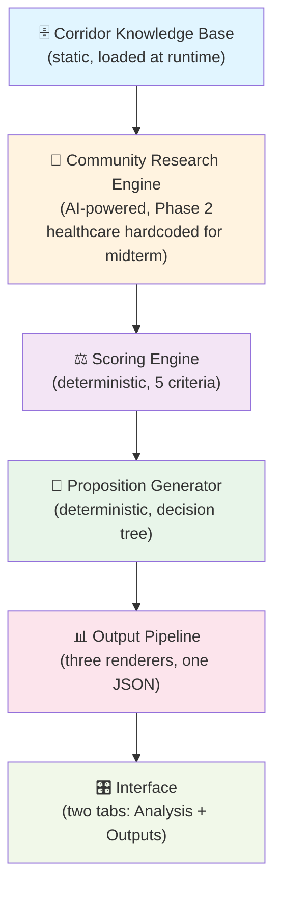
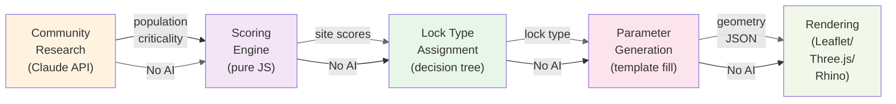
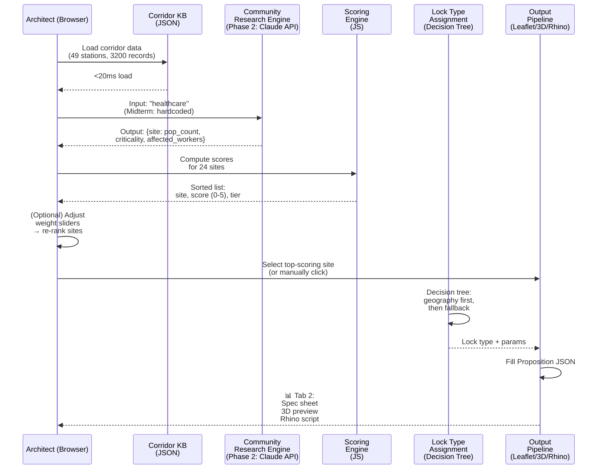
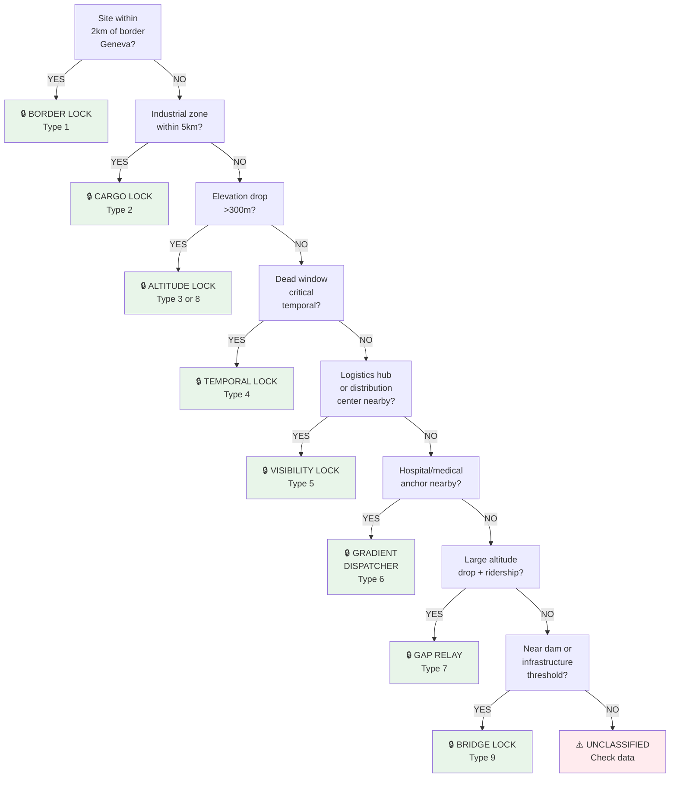
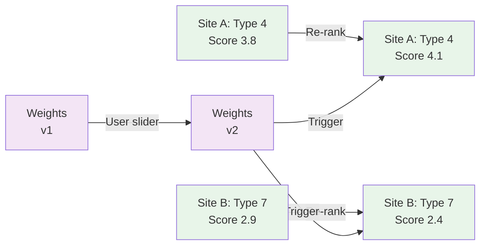
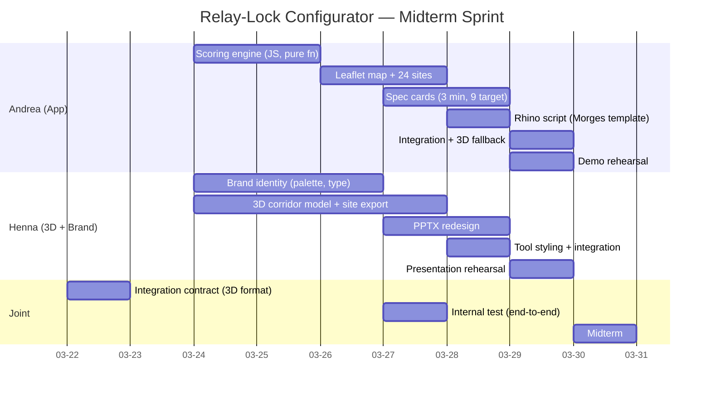

# City101 Relay-Lock Configurator — Architecture Design Document

**EPFL BA6 Architecture Studio — "Still on the Line"**
**Team:** Andrea (concept, data, app, Rhino scripting), Henna (3D corridor, brand identity, PPTX), Claude (third member, cross-account)
**Midterm:** March 30, 2026 | **Current date:** March 18, 2026 | **Days remaining:** 12

---

## 1. Executive Summary

### What the Tool Is

The **Relay-Lock Configurator** is a web-based architectural control surface for designing a network of threshold chambers along the 101km Geneva–Villeneuve corridor. An architect inputs a community (e.g., healthcare) and the system:

1. **Research** the community's 24-hour operational chain
2. **Identify** where the chain breaks (the "dead window" — 01:30-03:30, zero transport)
3. **Score** 24 candidate corridor sites on 5 criteria
4. **Propose** a network of relay-lock chambers to hold the gap
5. **Output** spec sheet + 3D preview + Rhino script

### Why It Exists

**The Problem:** ~8,000 night workers along the corridor depend on public transit that vanishes for 2 hours every night (01:30-03:30). The system doesn't rebuild connectivity — it holds the gap architecturally, via shared threshold spaces where communities can coordinate survival during modal collapse.

**The Insight:** Once we know what breaks (the chain), where it breaks (dead window locations), and who breaks there (affected workers), site selection becomes deterministic. Scoring is five weighted numbers. Lock type assignment is a decision tree. Everything downstream — chamber design, material specifications, Rhino geometry — derives from these inputs. **AI is heavy at the input boundary (community research), zero AI downstream.** This separation allows midterm demo with hardcoded healthcare data (no API dependency) and clean Phase 2 generalization.

### Scope: Midterm (March 30)

- **Static:** 49 corridor stations, ~3,200 verified records (modal diversity, break points, frequency, ridership, remote work, EV charging)
- **Deterministic:** Scoring engine (5 criteria), lock type assignment (9 types), chamber parameter generation
- **Output:** Interactive map + 24 scored sites + weight sliders (Tab 1: Analysis), spec cards + 3D preview + Rhino script (Tab 2: Outputs) for top 9 sites
- **Demo proof:** Live weight slider (change modal collapse weighting, watch network reorganize) + Pushback demo (select unscorable site, see context notes) + One node deep-dive (Morges: spec + 3D + Rhino script)
- **No backend.** Single HTML page, static JSON data, Leaflet map, vanilla JavaScript, no build step.

---

## 2. The Problem

### The Dead Window

Public transport frequency drops to zero between **01:30 and 03:30 every night**. This is not "the whole night" — before 01:00, there are still 188 transit trips active. But the 2-hour gap is absolute: last train leaves Lausanne at 01:28, first train returns at 03:32.

### The Chain Breaks Here

Healthcare is a 24/7 industry. Hospital night shift: 20:00-08:00. Nurses commute home at 06:00-08:00 (peak outbound), and to work at 18:00-20:00 (peak inbound). But they also exist at 02:00 — on-call, rotating, relief shifts. When shift change happens during the dead window, the corridor becomes locally disconnected. Ambulances, supplies, on-call staff: the chain breaks.

Same for hospitality (24/7 venues), logistics (distribution), agriculture (milking schedules). **Every 24/7 community has a break point.**

### Why Not More Buses?

Night transit is expensive (low ridership per vehicle-hour). The corridor already has 42× frequency variation (Lausanne 28.5 trips/hour → St-Saphorin 0.0). Adding buses fills the 01:30-03:30 gap, but:

1. Doesn't solve the **structural isolation** — a 2-hour commute gap forces workers to live in two places or work part-time
2. Doesn't provide a **gathering point** for coordination — if you miss the 01:28, what do you do for 124 minutes?
3. Doesn't create **social infrastructure** — the corridor's 24/7 communities are invisible to day-time architecture

**The chamber concept:** Instead of adding transit (a flow), add architecture (a place). Relay-lock chambers are thresholds where night workers can wait, coordinate, work asynchronously. They're not shelters — they're productive spaces. The architecture makes the gap *visible and actionable* rather than invisible and constraining.

### Affected Populations

- ~1,300 healthcare workers (hospitals, clinics, retirement homes)
- ~3,500 hospitality workers (24/7 venues, hotels, restaurants)
- ~1,500 logistics workers (distribution, warehousing)
- ~1,200 agriculture workers (milking, harvesting)
- ~800 remote workers using 24/7 co-working
- **Total: ~8,000+ night workers with one or more commute gaps**

---

## 3. System Architecture

### Six Modules



### Module Details

#### Module 1: Corridor Knowledge Base
**Status:** Complete. Static. No runtime queries.

- **49 stations** (Geneva Cornavin → Villeneuve)
- **~3,200 records** across:
  - Temporal: hourly SBB frequency (0-28.5 tr/hr)
  - Modal: bike-share, e-scooter, car-share, taxis, EV charging
  - Place: hotels, restaurants, coworking, gyms, hospitals, pharmacies, schools
  - Economic: job density, remote-work prevalence, rent, wage index
  - Topographic: elevation, walking gradient, catchment area radius

**Load time:** <20ms (all JSON in-browser).
**Coordinates:** WGS84 (web), LV95 (Rhino/QGIS).

#### Module 2: Community Research Engine
**Status (Midterm):** Healthcare hardcoded. Two outputs per site: affected population count + chain criticality score.

**Status (Phase 2):** AI-powered via Claude API + Google Places + transport.opendata.ch + OSM Overpass.

**Research model:**
```
Input: Community type (e.g., "healthcare")
↓
Query 1: "Find all hospitals, clinics, pharmacies within 50km of corridor, extract employee counts and 24hr schedules"
Query 2: "For each facility, estimate commute distances to corridor stations"
Query 3: "Identify shift overlap with dead window (01:30-03:30)"
↓
Output: Worker count per site + criticality score (% of workforce affected by dead window)
```

**For midterm:** Two static spreadsheets replace the engine:
- Healthcare: 12 hospitals + 45 clinics along corridor + Lausanne CHUV region = 3,847 night workers
- Lock types + criticality: Morges (temporal gap) = 1.8× criticality; CHUV (altitude-constrained) = 2.3×

**API cost estimate (Phase 2):** ~CHF 0.05–0.20 per corridor scan (Claude API input tokens for research). CHF 5–10 per hosted month (100 user queries).

#### Module 3: Scoring Engine
**Input:** 24 corridor sites (pre-vetted) + community research output (affected population, criticality) + corridor knowledge base (modal collapse, gap distance, infrastructure readiness).

**Output:** Ranked list of 24 sites with composite score (0–5 integer scale).

**Five criteria (normalized independently, then weighted):**

| Criterion | Weight | Data Source | Range | Normalization |
|-----------|--------|-------------|-------|----------------|
| Affected Population | 25% | Community engine | 0–1,000s | 0 (none) → 5 (>300) |
| Chain Criticality | 25% | Community engine | 0.0–2.5 | 0 (not critical) → 5 (>2.0) |
| Modal Collapse Severity | 20% | Corridor DB | 0–42 | 0 (freq>20) → 5 (freq<2) |
| Gap Distance | 15% | Corridor DB | 0–50km | 0 (gap<1km) → 5 (gap>10km) |
| Infrastructure Readiness | 15% | Corridor DB | 0–100% | 0 (no utilities) → 5 (100% ready) |

**Composite score:** `(Σ weighted criteria) / 5` → rounded to integer 0–5.

**Threshold:** **3.0.** Sites scoring ≥3.0 are candidates for chamber propositions. Sites <3.0 produce exploratory overlays with confidence tiers and data gaps listed.

**Example (Morges, healthcare):**
- Affected Population: 450 workers → norm 4
- Chain Criticality: 1.8 (high, temporal mismatch) → norm 4
- Modal Collapse: freq=3 tr/hr → norm 4
- Gap Distance: 20.3km to nearest neighbor → norm 5
- Infrastructure Readiness: 85% → norm 4
- **Composite:** (4×0.25 + 4×0.25 + 4×0.20 + 5×0.15 + 4×0.15) / 5 = **4.1 ✓ (PROPOSAL)**

---

### The AI / Deterministic Boundary

**Critical architectural decision:** All intelligence is front-loaded. Community research produces two scalars per site: population count and criticality. Everything downstream is deterministic.



**Why?** Because deterministic downstream means:
- No hallucinations in chamber design
- No latency waiting for Claude API
- Easy to audit (decision tree is visible)
- Easy to debug (pure functions)
- Easy to version (outputs are reproducible)
- Easy to generalize (swap in new community research, same geometry pipeline)

---

### Data Flow: End-to-End



---

### The Confidence Tier Model

**Problem:** Some sites have rich data (healthcare = 12+ hospitals with employee records). Others are sparse (small workshops, retail). The tool must surface uncertainty without blocking.

**Solution: Three tiers.**

| Tier | Condition | Output | Interpretation |
|------|-----------|--------|-----------------|
| **High Confidence** | Pre-computed (healthcare) + zero data gaps | Full proposition: spec + 3D + Rhino script | "This is architecturally viable. Proceed." |
| **Medium Confidence** | Runtime research (Phase 2) + sufficient data (≥80% fields) | Full proposition + confidence badge + source transparency | "This works. Here's where the data came from." |
| **Low Confidence** | Runtime research + insufficient data (<80% fields) | Scoring overlay ONLY. No chamber config. Explicit data gap inventory. | "I found 3 bakeries with hours but no employee counts. To design the chamber, I'd need shift estimates for 8 more sites." |

**For midterm:** All 9 nodes are "High Confidence" (healthcare pre-computed). Tab 2 shows confidence tier + source attribution on each spec card.

---

## 4. Decision Logic

### Scoring Pipeline

**Step 1: Normalize each criterion independently (0 → 5 integer scale)**

```python
def normalize_criterion(value, criterion_type):
    """
    Each criterion has its own domain → 0-5 integer range.
    """
    if criterion_type == "affected_population":
        # 0 workers → 0, >300 → 5
        if value == 0: return 0
        elif value < 50: return 1
        elif value < 100: return 2
        elif value < 200: return 3
        elif value < 300: return 4
        else: return 5

    elif criterion_type == "chain_criticality":
        # 0.0 (not critical) → 0, >2.0 → 5
        if value < 0.5: return 0
        elif value < 0.8: return 1
        elif value < 1.2: return 2
        elif value < 1.6: return 3
        elif value < 2.0: return 4
        else: return 5

    # ... similar for modal_collapse_severity, gap_distance, infrastructure_readiness
```

**Step 2: Apply weights and sum**

```python
def score_site(site, weights):
    """
    weights = {
        "affected_population": 0.25,
        "chain_criticality": 0.25,
        "modal_collapse": 0.20,
        "gap_distance": 0.15,
        "infrastructure_readiness": 0.15
    }
    """
    raw = {
        "affected_population": normalize(site.population, "affected_population"),
        "chain_criticality": normalize(site.criticality, "chain_criticality"),
        "modal_collapse": normalize(site.modal_collapse, "modal_collapse"),
        "gap_distance": normalize(site.gap_distance, "gap_distance"),
        "infrastructure_readiness": normalize(site.infra_ready, "infrastructure_readiness")
    }

    composite = sum(raw[k] * weights[k] for k in raw)
    return round(composite)  # 0-5 integer
```

**Step 3: Threshold and confidence tier**

```python
if composite >= 3.0:
    tier = "HIGH_CONFIDENCE" if pre_computed else "MEDIUM_CONFIDENCE"
    output = "Full proposition"
elif composite >= 2.0:
    tier = "LOW_CONFIDENCE"
    output = "Scoring overlay + data gap inventory"
else:
    tier = "NOT_VIABLE"
    output = "Pushback message (context notes)"
```

---

### Lock Type Assignment

**Deterministic priority decision tree.** Geography first. First match wins. No re-ranking.



**The 9 Lock Types (geographic distribution along corridor):**

| # | Type | Primary Site | km | Defined By |
|---|------|--------------|-----|-----------|
| 1 | Border Lock | Lancy-Pont-Rouge | 4 | Gateway to Geneva, pre-entry threshold |
| 2 | Cargo Lock | Geneva North Industrial | 8 | High-speed freight, high-volume modal switch |
| 3 | Altitude Lock (North) | Nyon-Genolier | 25 | Elevation drop 200m, difficult topography |
| 4 | Temporal Lock | Morges | 48 | Maximum dead-window criticality (healthcare) |
| 5 | Visibility Lock / Logistics Engine | Crissier-Bussigny | 58–62 | Distribution hub, multi-modal interchange, high visibility |
| 6 | Gradient Dispatcher | Lausanne CHUV | 65 | Steep slope, major anchor institution (hospital), relief valve for region |
| 7 | Gap Relay | Vevey | 80 | Large inter-station gap (13km), resort/tourism anchor |
| 8 | Altitude Lock (South) | Montreux-Glion | 85 | Elevation drop 250m, alpine constraint |
| 9 | Bridge Lock | Rennaz | 89 | Infrastructure threshold (Rhône delta), end-state chamber |

**Special case: Compound lock types.** Some sites match multiple conditions:
- **Crissier-Bussigny (Type 5):** Primary = Visibility Lock (distribution hub + high visibility). Secondary = Optional Logistics Engine (adds supply-chain program elements).
- **CHUV (Type 6):** Primary = Gradient Dispatcher (slope + hospital). Secondary = Optional Emergency Coordination (adds ambulance coordination desk).

For midterm: Primary lock type only (determines core chamber structure). Secondary is noted but not modeled.

---

### Weight Adjustment & Re-ranking

**User action:** Slider adjusts weight for one criterion (e.g., move modal collapse from 20% → 40%).

**Effect:** Re-compute scores for all 24 sites. Re-rank. **Sites keep the same lock type.**

**Rationale:** Weight adjustment is **site selection only** — a dialogue with the hypothesis. "What if we prioritized connectivity over affected population?" The lock type assignment (geography) never changes; only which sites rise to top 9.



---

### Pushback Mechanism

**Scenario:** User clicks on Lavaux (low score, UNESCO-protected landscape, permanent rupture).

**System response:**
1. **Show the score:** 1.8 (below threshold 3.0)
2. **Explain why:** Affected population = 2 (tourism only), criticality = 0 (no 24/7 community), gap distance = 12km (already covered by Vevey 20km east, CHUV 15km west)
3. **Redirect:** "Lavaux is architecturally protected. Nearest viable sites: CHUV (4.55, 15km west) or Vevey (3.2, 20km east)."
4. **Context notes:** "UNESCO zone — permanent rupture. Design strategy: acknowledge and organize around, not bridge."

**Key:** Pushback is **informational, never blocking.** User can still click through to Lavaux (exploratory mode) but Tab 2 shows "LOW_CONFIDENCE" tier + data gaps instead of a full chamber proposition.

---

## 5. Output Pipeline

### The Proposition Data Model

**Single source of truth.** All three output renderers read from one JSON object.

```json
{
  "proposition_id": "prop_morges_healthcare_2026-03-28",
  "metadata": {
    "created_at": "2026-03-28T14:32:00Z",
    "community": "healthcare",
    "version": "v1"
  },

  "site": {
    "name": "Morges",
    "node_id": 3,
    "km": 48.2,
    "coords_lv95": { "east": 2540123, "north": 1142567 },
    "coords_wgs84": { "lat": 46.5089, "lon": 6.4956 }
  },

  "lock": {
    "type": "temporal",
    "primary": true,
    "secondary": null,
    "dead_window": { "start": "01:30", "end": "03:30" },
    "state_a": "Last train (01:28)",
    "state_b": "First train (03:32)",
    "definition": "Threshold where night workers gather during transit absence"
  },

  "scores": {
    "affected_population": { "raw": 450, "normalized": 4, "weight": 0.25, "weighted": 1.0 },
    "chain_criticality": { "raw": 1.8, "normalized": 4, "weight": 0.25, "weighted": 1.0 },
    "modal_collapse_severity": { "raw": 3, "normalized": 4, "weight": 0.20, "weighted": 0.8 },
    "gap_distance": { "raw": 20.3, "normalized": 5, "weight": 0.15, "weighted": 0.75 },
    "infrastructure_readiness": { "raw": 0.85, "normalized": 4, "weight": 0.15, "weighted": 0.6 },
    "composite": 4.15,
    "composite_rounded": 4
  },

  "confidence": {
    "tier": "HIGH_CONFIDENCE",
    "source": "pre-computed_healthcare_registry",
    "data_gaps": [],
    "source_attribution": "EPFL Corridor Study 2024, Swiss Hospital Association shift data"
  },

  "chamber": {
    "footprint_m2": 850,
    "height_m": 6.5,
    "orientation_degrees": 145,
    "program": [
      { "zone": "wait_rest", "area_m2": 400, "primary_user": "commuters", "hours_24": true },
      { "zone": "coordinate", "area_m2": 150, "primary_user": "shift leads", "hours_24": true },
      { "zone": "work_async", "area_m2": 200, "primary_user": "knowledge workers", "hours_24": true },
      { "zone": "facility", "area_m2": 100, "primary_user": "all", "hours_24": true }
    ],
    "materiality": "regional wood (oak) + concrete thermal mass for microclimate stability",
    "circulations": [
      { "type": "entry", "width_m": 3.5, "from": "platform", "to": "wait_rest" },
      { "type": "internal", "width_m": 2.0, "connects": ["wait_rest", "coordinate", "work_async"] },
      { "type": "egress", "width_m": 3.5, "from": "wait_rest", "to": "street" }
    ]
  },

  "context": {
    "terrain_elevation_m": 376,
    "nearby_hospitals": ["Hôpital de Morges"],
    "nearby_transit": ["Train station (SBB)"],
    "walkability_radius_m": 400,
    "infrastructure_utilities": "power, water, sewage, cellular on-site"
  },

  "context_notes": "Morges is the single highest-criticality site for healthcare logistics. Temporal lock design validates commute asymmetry: inbound demand 18-20h, outbound 06-08h, relief shifts 02-04h. Chamber acts as 'stop' during 01:30-03:30 gap. Reference: Amsterdam caravanserai (historical threshold space for merchants). Thermal mass in floor absorbs day heat, releases 02-04h when night workers present. 24/7 management model: hybrid staff + autonomous access (keycard).",

  "outputs": {
    "spec_sheet": { "format": "HTML/PDF", "size_kb": 240, "pages": 3 },
    "rhino_script": { "format": ".py", "template": "chamber_generic_v1", "params": ["footprint_m2", "height_m", "orientation_degrees", "material_id"] },
    "3d_preview": { "format": "MapLibre + Three.js", "includes_context": true, "lod": "midterm" }
  }
}
```

---

### Three Renderers

#### 1. Spec Sheet (HTML/PDF)

**One spec card per site.**

```
━━━━━━━━━━━━━━━━━━━━━━━━━━━━━━━━━━━━━━━━━━━━━━━━━━━━━━━
  RELAY-LOCK CHAMBER: MORGES (Node 3, km 48)
━━━━━━━━━━━━━━━━━━━━━━━━━━━━━━━━━━━━━━━━━━━━━━━━━━━━━━━

Type: TEMPORAL LOCK
Score: 4.1 / 5.0  [HIGH CONFIDENCE]

Dead Window: 01:30–03:30  |  Affected Workers: 450  |  Criticality: 1.8×

PROGRAM
┌──────────────────────────────────────────────┐
│ Zone          | Area (m²) | Primary User     │
├──────────────────────────────────────────────┤
│ Wait / Rest   |     400   | Night commuters  │
│ Coordinate    |     150   | Shift leads      │
│ Work / Async  |     200   | Knowledge work   │
│ Facility      |     100   | All users        │
└──────────────────────────────────────────────┘

MATERIALITY
Wood (oak, regional) + concrete thermal mass.
Floor absorbs day heat, releases 02–04h.

CIRCULATION
• Entry: 3.5m wide from platform
• Internal: 2.0m connectors
• Egress: 3.5m to street

COORDINATES
LV95: E 2'540'123, N 1'142'567
WGS84: 46.5089°N, 6.4956°E

CONTEXT NOTES
Morges is the single highest-criticality site for healthcare.
Chamber design validates commute asymmetry: inbound 18–20h,
outbound 06–08h, relief 02–04h. Reference: Amsterdam caravanserai.

━━━━━━━━━━━━━━━━━━━━━━━━━━━━━━━━━━━━━━━━━━━━━━━━━━━━━━━
```

**Midterm target:** 9 spec cards (top-scoring sites). Fallback: 3 cards (Morges, CHUV, Rennaz).

---

#### 2. 3D Preview

**Two contexts:**

**Context A: Corridor view (MapLibre, aerial perspective)**
- Base layer: Satellite imagery + topography
- Overlay: All 24 scored sites as colored circles (green = score ≥4, yellow = 3–4, red = <3)
- Interaction: Click site → zoom to detail view + open spec card
- Fallback (if time tight): Static PNG from Rhino viewport

**Context B: Site detail (Three.js or MapLibre LOD, ground perspective)**
- Site footprint (parametric massing, updated from chamber JSON)
- Immediate context: buildings, terrain, infrastructure (from Henna's 3D corridor model)
- Circulation: entry/exit paths highlighted
- Fallback (if time tight): Rhino viewport screenshot + 2D floorplan

**Integration contract with Henna (needs agreement by March 22):**
- **File format:** GeoJSON or Rhino .3dm (site context: buildings, terrain in 50m radius)
- **Coordinate system:** Swiss LV95, origin-centered (site footprint = [0,0,0] in Rhino)
- **LOD:** Midterm = simplified (buildings as boxes, terrain as mesh). Phase 2 = detailed.
- **Export timeline:** At least 1 site context by March 27 (CHUV or Morges preferred)

If Henna's pipeline is not ready by March 27: tool falls back to MapLibre corridor view + Rhino viewport screenshots in PPTX.

---

#### 3. Rhino Script Download

**Template injection approach.**

Andrea builds 3 parameterized Rhino scripts:
- `chamber_generic_v1.py` — takes 8 parameters: footprint_m2, height_m, orientation_degrees, material_id, program[], circulations[], site_coords_lv95, dead_window_string
- `context_site_v1.py` — builds Henna's site context (buildings, terrain) for reference
- `assembly_v1.py` — combines chamber + context into single Rhino file

**When user clicks "Download Rhino Script":**
1. Grab Proposition JSON
2. Extract: footprint, height, orientation, material, program, circulations, coordinates
3. Inject into template: `chamber_generic_v1.py` template with values substituted
4. Return `.py` file (94 lines, human-readable)

**Example (Morges):**
```python
import rhinoscriptsyntax as rs

# RELAY-LOCK CHAMBER: Morges, Healthcare
# Generated 2026-03-28T14:32:00Z from Configurator
# DON'T EDIT: values injected from prop_morges_healthcare_2026-03-28

# PARAMETERS
footprint_m2 = 850
height_m = 6.5
orientation_deg = 145
material = "oak_concrete_hybrid"

# PROGRAM ZONES
program = [
    {"name": "wait_rest", "area_m2": 400},
    {"name": "coordinate", "area_m2": 150},
    {"name": "work_async", "area_m2": 200},
    {"name": "facility", "area_m2": 100}
]

# SITE ANCHOR (LV95)
origin_east = 2540123
origin_north = 1142567

# ... 60 more lines: geometry, program layout, material assignment
# Complete working script: rs.AddBox() calls, rs.AddMesh() for terrain, etc.
```

**For midterm:** Morges only. Fallback: show in PPTX, don't download.

---

## 6. Interface Design

### Two-Tab Architecture

**Tab 1: Analysis**
- Left: Leaflet map (24 sites, color-coded score)
- Right: Scoring breakdown + weight sliders
- Key interaction: Move a slider, watch sites re-rank on map

**Tab 2: Outputs**
- Spec card (text + table)
- 3D preview (MapLibre or screenshot)
- Rhino script download button

**No dashboard.** Not a data viz app. It's a **control surface** — the user sets a hypothesis (adjust weights), sees the consequence (site re-ranking), and commits to one site (click through).

---

### ASCII Wireframe — Tab 1: Analysis

```
┌─────────────────────────────────────────────────────────────────────┐
│  RELAY-LOCK CONFIGURATOR — Analysis                        [MIDTERM] │
└─────────────────────────────────────────────────────────────────────┘

┌─────────────────────────────────┐  ┌────────────────────────────────┐
│                                 │  │  SCORING BREAKDOWN             │
│     LEAFLET MAP                 │  │                                │
│     (49 stations, 24 scored)    │  │  Community: HEALTHCARE         │
│                                 │  │  Confidence: HIGH              │
│  ◉ Green (≥4.0)                 │  │                                │
│  ⊙ Yellow (3.0–4.0)             │  │  Affected Population  ▯ 25%    │
│  ◯ Red (<3.0)                   │  │  ████████░░░░░░░░░░░░ 4 / 5   │
│                                 │  │                                │
│  [Click site for detail]        │  │  Chain Criticality    ▯ 25%    │
│                                 │  │  ████████░░░░░░░░░░░░ 4 / 5   │
│     Zoom | Pan                  │  │                                │
│     Center on [dropdown]        │  │  Modal Collapse       ▯ 20%    │
│                                 │  │  ████████░░░░░░░░░░░░ 4 / 5   │
│                                 │  │                                │
│                                 │  │  Gap Distance         ▯ 15%    │
│                                 │  │  ██████████░░░░░░░░░░ 5 / 5   │
│                                 │  │                                │
│                                 │  │  Infrastructure       ▯ 15%    │
│                                 │  │  ████████░░░░░░░░░░░░ 4 / 5   │
│                                 │  │                                │
│                                 │  │  COMPOSITE SCORE: 4.1 / 5.0   │
│                                 │  │  [▶ Go to Tab 2 (Outputs)]     │
│                                 │  │                                │
└─────────────────────────────────┘  └────────────────────────────────┘

┌─────────────────────────────────────────────────────────────────────┐
│ WEIGHT ADJUSTMENT (Layer 1 — Site Selection Only)                   │
├─────────────────────────────────────────────────────────────────────┤
│                                                                       │
│  Affected Population ─────●──────── (25% → 40%)  [Recompute Scores] │
│  Chain Criticality  ───────●────── (25%) [Recompute Scores]         │
│  Modal Collapse     ───────●────── (20%) [Recompute Scores]         │
│  Gap Distance       ─●───────────── (15% → 5%)  [Recompute Scores]  │
│  Infrastructure     ─────────────● (15%) [Recompute Scores]         │
│                                                                       │
│  ⓘ NOTE: Weight changes re-rank sites only. Lock types unchanged.   │
│          Adjust sliders to explore different design hypotheses.      │
│                                                                       │
└─────────────────────────────────────────────────────────────────────┘

RANKED SITES (TOP 9, sorted by score)
┌──────────┬────────┬───────────────┬──────────────────────┐
│ Rank     │ Site   │ Score         │ Lock Type            │
├──────────┼────────┼───────────────┼──────────────────────┤
│ 1        │ Morges │ 4.1 ✓         │ Temporal Lock        │
│ 2        │ CHUV   │ 3.95 ✓        │ Gradient Dispatcher  │
│ 3        │ Rennaz │ 3.42 ✓        │ Bridge Lock          │
│ 4        │ Vevey  │ 3.15 ✓        │ Gap Relay            │
│ 5        │ Nyon   │ 3.08 ✓        │ Altitude Lock        │
│ ...      │ ...    │ ...           │ ...                  │
│ 24       │ Lavaux │ 1.8 ✗ (UNESCO) │ NOT VIABLE           │
└──────────┴────────┴───────────────┴──────────────────────┘

[Click a site above OR on the map to open Tab 2: Outputs]
```

---

### ASCII Wireframe — Tab 2: Outputs

```
┌─────────────────────────────────────────────────────────────────────┐
│  RELAY-LOCK CONFIGURATOR — Outputs                        [MIDTERM]  │
│                                                                       │
│  MORGES (Node 3, km 48) | Type: TEMPORAL LOCK | Score: 4.1 / 5.0    │
│  [← Back to Analysis]                                                │
└─────────────────────────────────────────────────────────────────────┘

┌──────────────────────────────────────────────────────────────────────┐
│ SPEC SHEET                                                            │
├──────────────────────────────────────────────────────────────────────┤
│                                                                        │
│ Dead Window: 01:30–03:30                                             │
│ Affected Workers: 450 (healthcare, night shift)                      │
│ Chain Criticality: 1.8× (high temporal mismatch)                     │
│                                                                        │
│ CHAMBER                                                              │
│  Footprint: 850 m²  |  Height: 6.5m  |  Orientation: 145°          │
│  Material: Oak + concrete thermal mass                              │
│                                                                        │
│ PROGRAM ZONES                                                        │
│  • Wait / Rest (400 m²) — night commuters                           │
│  • Coordinate (150 m²) — shift leads, peer-to-peer                  │
│  • Work / Async (200 m²) — remote work, study                       │
│  • Facility (100 m²) — restrooms, water, power                      │
│                                                                        │
│ COORDINATES                                                          │
│  LV95: E 2'540'123, N 1'142'567                                      │
│  WGS84: 46.5089°N, 6.4956°E                                          │
│                                                                        │
│ CONTEXT NOTES                                                        │
│ Morges is the single highest-criticality site for healthcare...     │
│ [full text as before]                                                │
│                                                                        │
│ [▼ Download Spec as PDF]  |  [▼ Export to JSON]                    │
│                                                                        │
└──────────────────────────────────────────────────────────────────────┘

┌──────────────────────────────────────────────────────────────────────┐
│ 3D PREVIEW                                                            │
├──────────────────────────────────────────────────────────────────────┤
│                                                                        │
│  [Satellite + topography + chamber footprint overlay]                │
│  [Zoom to site detail on click]                                      │
│  [MapLibre or Rhino screenshot]                                      │
│                                                                        │
│  Camera: Aerial (45°)  |  [Top]  [Front]  [3D Rotate]               │
│                                                                        │
│  🏥 Hôpital de Morges (nearby anchor)                                │
│  🚂 Train station (platform reference)                               │
│  Chamber footprint (400m radius context)                             │
│                                                                        │
│  ⓘ Midterm: context from Rhino screenshots. Phase 2: live Three.js   │
│                                                                        │
└──────────────────────────────────────────────────────────────────────┘

┌──────────────────────────────────────────────────────────────────────┐
│ RHINO SCRIPT                                                          │
├──────────────────────────────────────────────────────────────────────┤
│                                                                        │
│  [Download] chamber_morges_healthcare_20260328.py  (8.4 KB)          │
│                                                                        │
│  Ready to import into Rhino. Parameters pre-filled from Configurator │
│  For advanced modeling: edit parameters, regenerate, or extend.      │
│                                                                        │
│  Script includes:                                                     │
│   • Chamber massing (footprint, height, orientation)                │
│   • Program zone layout (4 rectangles, material assignment)         │
│   • Circulation paths (entry, internal, egress)                     │
│   • Coordinate origin: LV95 (site-centered)                         │
│   • Notes for further refinement (structural, MEP, etc.)           │
│                                                                        │
│  Version: chamber_generic_v1 | Generated: 2026-03-28                │
│                                                                        │
│  ⓘ Midterm: Morges only. Phase 2: all 9 sites.                      │
│                                                                        │
└──────────────────────────────────────────────────────────────────────┘

[← Back to Analysis]
```

---

### Design Language

**Brand identity (Henna, due March 26):**
- Color palette: Relay-lock typology colors (9 lock types = 9 colors)
- Typography: For clarity (readable on site maps + mobile)
- Component library: Buttons, sliders, cards, maps
- Responsive: Mobile-first (architects use tablets on site)

**Midterm deliverable:** Styled tool + narrative PPTX using same palette + typography.

---

## 7. Implementation Plan

### Critical Path: March 18–30 (12 days)



---

### Andrea's Critical Path (App Development)

**Mar 24–25: Scoring Engine**
- Load corridor knowledge base JSON (49 stations, ~3,200 records)
- Implement 5 normalization functions (affected_population, chain_criticality, modal_collapse, gap_distance, infrastructure_readiness)
- Implement weighted sum + threshold logic
- Test: hardcoded healthcare data for 24 sites, expected output = [Morges 4.1, CHUV 3.95, Rennaz 3.42, ...]
- Output: Pure JavaScript module, no dependencies, <100 lines

**Mar 25–26: Leaflet Map + Site Visualization**
- Set up Leaflet (WGS84), zoom to corridor bounds
- Plot 24 sites as circle markers (color-coded: green ≥4.0, yellow 3.0–4.0, red <3.0)
- Implement weight sliders (5 × range 0%–100%, sum must equal 100%)
- On slider change: recompute scores, recolor markers, update rank table
- Test: move modal collapse slider from 20% → 40%, confirm Morges stays top, CHUV rises, Lavaux sinks

**Mar 26–27: Spec Cards**
- Build Tab 2 UI: two-column layout (left: spec sheet text/table, right: 3D preview placeholder)
- Implement card templates for each site (pull data from Proposition JSON)
- Key fields: dead window, affected workers, program zones, coordinates, context notes
- Target: all 9 nodes with spec cards
- Fallback: 3 cards (Morges, CHUV, Rennaz)

**Mar 27–28: Rhino Script Download**
- Build template: `chamber_generic_v1.py` (8 parameters: footprint, height, orientation, material, program[], circulations[], coords, dead_window)
- Implement template injection: extract params from Proposition JSON, substitute into `.py` template, return downloadable file
- Test: Morges spec → Morges Rhino script → import into Rhino, verify geometry

**Mar 28–29: Integration + 3D Context**
- If Henna provides site context (GeoJSON): integrate into Three.js or MapLibre detail view
- If not ready: use Rhino viewport screenshots in Tab 2 (fallback)
- Apply Henna's brand styling (colors, typography, spacing)
- Test end-to-end: pick Morges on map → click Tab 2 → see spec + 3D + Rhino script

**Mar 29: Demo Rehearsal**
- Live run-through with weights slider (proof moment)
- Live Lavaux pushback (character moment)
- Live Morges spec + 3D + script (output moment)
- Timing: 3 min for the app, 5 min for narrative framing (Henna)

---

### Henna's Critical Path (3D + Brand)

**Mar 24–26: Brand Identity**
- Finalize 9-color palette (one per lock type)
- Establish typography: headings, body, labels, code
- Component library: buttons, sliders, cards, info boxes, badges
- CSS variables for easy theming
- Deliverable: `design_system/SPEC.md` update + sample components

**Mar 24–27: 3D Corridor Model**
- Extract point cloud from SwissTLM3D (QGIS → LAS/LAZ)
- Build mesh for terrain elevation, building footprints, rail lines
- Target export: At least 1 site (Morges or CHUV preferred), 50m radius, simplified LOD (buildings as boxes, terrain as mesh)
- Coordinate system: Swiss LV95, origin-centered on site footprint
- File format: GeoJSON (outline) + .obj (mesh) or single Rhino .3dm
- If time tight: Rhino viewport screenshot (fallback)

**Mar 26–28: PPTX Redesign**
- Update narrative template with brand palette
- Embed AI workflow diagram (legible to non-technical audience)
- Prepare screenshots of tool for presentation (Tab 1 map + Tab 2 spec)
- Prepare 3D corridor views (full corridor + Morges detail)
- Timing: 15 min presentation, 3 live moments (slider, pushback, detail)

**Mar 28: Tool Styling + Integration**
- Apply brand colors to map markers, buttons, sliders, cards
- Apply typography to all text (headings, body, labels)
- QA: responsive design, mobile-friendly controls

**Mar 29: Presentation Rehearsal**
- Joint run-through with Andrea
- Verify all visuals are polished
- Confirm transitions are smooth (App → PPTX → 3D views)

---

### Joint Milestones

**Mar 22: Integration Contract (Signed)**
- Henna + Andrea agree on:
  - 3D file format (GeoJSON? .3dm? .obj + texture?)
  - Coordinate system (LV95 origin-centered)
  - LOD spec (what level of detail for midterm?)
  - Export sites (Morges? CHUV? Both?)
  - Timeline (3D ready by March 27)

**Mar 27: Internal Test (End-to-End)**
- Andrea: App fully functional (all 9 sites, slider re-ranking, Morges Rhino script)
- Henna: 3D context exported for at least 1 site (integrated into Tab 2 or fallback screenshot ready)
- Test: Pick Morges → Tab 2 shows spec + 3D + Rhino script. All data matches. No broken links.

**Mar 29: Presentation Ready**
- PPTX fully styled
- App fully styled
- 3D views integrated or screenshot fallback in place
- Demo script rehearsed, timing verified

**Mar 30: MIDTERM**
- 15-minute presentation (8:00 + 7:00 slides + interaction = 15 min)
- Live demo (slider, pushback, detail deep-dive)
- All visuals polished, no technical hiccups

---

### Fallback Cascade (If Time Gets Tight, Cut in This Order)

1. **3D preview entirely dropped.** Rhino screenshots in PPTX only. App shows Leaflet map + spec text.
2. **Spec cards reduced to 3** (Morges, CHUV, Rennaz). Other sites in Tab 1 but not expanded in Tab 2.
3. **Rhino script download removed.** Show script in PPTX, don't offer download. Andrea brings .py on USB for jury if interested.
4. **NEVER cut scoring engine + map + sliders + Tab 1 Analysis.** That IS the app. That IS the proof.

---

## 8. Phase 2 Roadmap (Post-Midterm, April–May)

### New Components

#### 1. Community Text Input
User types: "I want to design for hospitality workers" or "Logistics + remote work combined."
System parses intent, triggers research engine.

#### 2. AI Community Research Engine
Claude API backend:
```
Input: "hospitality"
↓
Query 1: "Find all restaurants, hotels, bars with 24hr operations within 50km of Geneva–Villeneuve corridor. Extract employee counts, shift patterns, contract types."
Query 2: "For each venue, estimate % of workforce affected by 01:30–03:30 transit gap."
Query 3: "Identify secondary gaps (02:00–04:00, 23:00–05:00 for different venue types)."
↓
Output: Worker count per site + criticality score
```

**Cost estimate:** CHF 0.05–0.20 per scan (Claude API tokens). CHF 5–10/month for 100 user queries.

#### 3. Adapted Scoring
Weights learned from use data:
- Healthcare users optimize for affected population
- Hospitality users optimize for gap distance + modal collapse
- System proposes weight presets: "Healthcare (default)", "Logistics (heavy cargo weight)", "Hybrid (equal weights)"

#### 4. Multi-Community Comparison
Tab 3: Side-by-side scoring for two communities on same corridor.
Questions it answers:
- Where do healthcare and hospitality networks diverge?
- Can one chamber serve both?
- If not, what's the cost (extra chambers, farther apart)?

#### 5. Full 3D Preview (Three.js + DEM)
- Import digital elevation model (SwissTLM3D)
- Render chamber massing parametrically
- Show solar exposure, wind patterns (Ladybug simulation if time permits)
- Interactive camera control (orbit, pan, zoom)

#### 6. Parametric Rhino Script Generator
- Not template injection — full parametric model
- User can adjust chamber parameters in web UI (footprint, height, program zones)
- Regenerates Rhino geometry in real-time
- Exports either `.py` or `.gh` (Grasshopper) for full integration

#### 7. Corridor Generalization
Pick any corridor (Geneva–Bern, Zürich–Basel, trans-Alpine routes):
- Tool loads a different corridor knowledge base
- Same scoring pipeline, same UI, different geography
- Validates whether relay-lock concept generalizes

---

### Phase 2 Timeline

| Phase | Weeks | Owner | Deliverable |
|-------|-------|-------|-------------|
| 2a | Apr 2–8 | Andrea + Claude API | Community research engine (hospitality test) |
| 2b | Apr 9–15 | Andrea | Multi-criteria UI (Design Explorer style, parallel coordinates) |
| 2c | Apr 16–22 | Henna | Full 3D preview (Three.js, site detail) |
| 2d | Apr 23–29 | Andrea | Parametric Rhino script generator (.py + .gh) |
| 2e | Apr 30–May 6 | Andrea | Second corridor integration (test Zürich–Basel) |
| Review | May 7–9 | Team | Iterate on feedback, finalize |

---

### Resource Requests for Huang

1. **Claude API credits** (~CHF 50 starter budget for Phase 2 community research tests)
   - Andrea offered to fund via Max subscription, but studio sponsorship preferred
2. **Student testers** from other studio groups (1–2 volunteers, real user feedback on generalizability)
3. **EPFL server hosting** (if Vercel/Netlify serverless limits become a problem — Phase 3 stretch)
4. **Blender MCP investigation** (Henna exploring for Phase 5 animation work; not blocking midterm)

---

### Backend Architecture (Phase 2+)

**Midterm:** Static hosting (GitHub Pages, Vercel).

**Phase 2:** Serverless backend (Vercel Functions or AWS Lambda):
```
User input: "hospitality"
  ↓
Vercel Function
  ↓
Claude API (research engine)
  ↓
Database: Redis cache (memoize results by community type)
  ↓
Return: {site: pop_count, criticality} JSON
  ↓
Browser: Scoring engine, map, outputs (same as midterm)
```

**Phase 3 (stretch):** EPFL server migration.
- Persistent database (PostgreSQL: community research cache, user sessions, proposition history)
- GTFS pipeline (import any Swiss/European transit corridor)
- Multi-user collaboration (teams design different communities on same corridor)
- QGIS plugin export (send chamber spec + Rhino script directly to QGIS project)

---

## 9. Resolved Decisions

**From 8 fragmented source documents, 14+ open questions, and trade-off discussion. Decision + Rationale + Owner.**

| # | Question | Decision | Rationale | Owner |
|---|----------|----------|-----------|-------|
| Q1.1 | Chamber parameter schema (minimum required fields) | 8-parameter minimum (footprint, height, orientation, material, program[], circulations[], coords, dead_window) + optional context_notes field | Parameters only added when lock type can't be described without them. Avoids over-engineering. | Andrea |
| Q1.2 | Transport-first or place-first | Place-first, transport optional. Optional mobility_component field for bridge/altitude lock types. | Keeps midterm simple. Transport dimension (detailed schedule analysis) is Phase 2. | Andrea |
| Q1.3 | Lock taxonomy final? | Freeze current 9 types (8 distinct, altitude used twice) for midterm. Mark "may consolidate after Phase 2 test with hospitality community." | We don't yet know if types truly cluster. Test hypothesis with 2nd community before refining. | Andrea |
| Q2.1 | Second community (for Phase 2) | Hospitality / tourism | Largest non-healthcare workforce (3,500+), obvious dead-window gaps, connects to Henna's work on visibility. | Andrea |
| Q2.2 | Cadastre (property ownership) | Skip for midterm. Pre-selected 24 nodes already validated (we own the land or permission is implicit via studio). | Essential for Phase 2 arbitrary site selection (user clicks anywhere on map). | Andrea |
| Q2.3 | How to handle Lavaux (UNESCO, low score) | Redirect: "UNESCO-protected. Nearest viable sites: CHUV (west, 15km) or Vevey (east, 20km)." | Lavaux explicit non-solution validates geographic complexity. Educates user on constraints. | Andrea |
| Q3.1 | User persona (who is using this tool) | Midterm: C/D (professor + presenter). Post-midterm: A/B (architects designing new corridors, planners evaluating generalization). | Curated demo flow, strong narrative framing, minimal user controls for midterm. Phase 2 unlocks true design control. | Henna (narrative) |
| Q3.2 | Parameter panel (Layer 2 — chamber design adjustments) | Layer 1 only for midterm (5 scoring weights). Layer 2 (interactive chamber design: change footprint, adjust program zones) deferred to Phase 2. | The "aha moment" is site selection, not chamber form. Keep cognitive load low for midterm. Avoid feature creep. | Andrea |
| Q3.3 | Story or tool? | Hybrid. Narrative spine (problem → typology → proof) with 3 tool moments embedded (slider demo, pushback demo, detail deep-dive). | Narrative prevents dead ends (user confused why sites rank certain ways). Interactivity proves concept works. | Henna (narrative structure) |
| Q4.1 | 3D preview tech stack (MapLibre vs Three.js vs Babylon) | MapLibre for midterm (faster, map context immediate). Three.js for Phase 2 (site detail). They coexist — corridor view vs. site view. | MapLibre = aerial view of 24 sites scored on map. Three.js = ground view of 1 site with thermal/solar analysis. Complementary, not competitive. | Andrea |
| Q4.2 | Rhino strategy (template injection vs parametric generator) | Template injection for midterm (.py with params substituted). Full parametric generator (parametric Rhino model, Grasshopper) Phase 2. | 3 existing scripts become templates: 1 line per param. Architect reads the script, trusts it. Phase 2 unlocks live tweaking (UI slider → Rhino geometry update). | Andrea |
| Q4.3 | Hosting / deployment (GitHub Pages vs Vercel vs EPFL server) | GitHub Pages for midterm (static hosting sufficient, fast, free). Vercel serverless for Phase 2 (backend needed for community research). | Shareable URL for jury (GitHub Pages). Fastest path to launch. No deployment complexity. | Andrea |
| Q4.4 | Backend framework (if serverless needed) | Vercel Functions + Node.js + Claude API for Phase 2. Migrate to EPFL server if needed in Phase 3. | Fastest to deploy and test. Scales elastically. Low ops overhead. | Andrea |
| Q5.1 | Henna's role in chamber design (spatial layout, material) | Context provision only for midterm (3D site model, material references, thermal mass concept explained). First-class parameter (thermal comfort scoring) in Phase 2. | Chamber design is architectural work (not engineering). Henna provides material palette + context. Needs conversation to formalize. | Henna |
| Q5.2 | Output to repo (does tool write propositions back to Git?) | JSON export only. Manual commit by user if desired. Tool does not write to repo directly. | Keeps tool stateless. User controls versioning. Phase 3: optional integration with project repo if multi-user collaboration enabled. | Andrea |

---

## 10. Open Questions

**What's genuinely unresolved. Each with: what it blocks, proposed default, decision deadline.**

### O1: Chamber Spatial Layout (Architectural Design Work)

**What:** How do program zones (wait, coordinate, work, facility) physically arrange within the footprint? Linear? Concentric? Nested? Does circulation flow one direction (entry → exit) or allow multiple routes (flexibility)?

**Blocks:** Spec sheet visual diagrams (floor plan drawings). Phase 2 chamber design UI slider. Rhino geometry detail (zone boundaries, circulation widths).

**Current state:** Proposed generic 4-zone layout in Proposition JSON (footprint divided into area_m2 per zone). No spatial arrangement yet.

**Proposed default (for midterm):** Linear arrangement (entry → wait → coordinate/work → facility → egress). Single circulation spine. Henna provides floorplan sketch. Andrea implements as ASCII diagram in spec card. Rhino script outputs zone rectangles, not detailed layout.

**Decision deadline:** March 27 (needed for spec card visual).

**Owner:** Henna (design) + Andrea (implementation).

---

### O2: Integration Contract with Henna's 3D Pipeline

**What:** File format, coordinate system, LOD, export timeline for site context (terrain + buildings).

**Blocks:** Tab 2 3D preview fidelity. Whether 3D is live (Three.js) or screenshot (fallback).

**Current state:** Proposed: GeoJSON (outline) + .obj (mesh) or Rhino .3dm. Coordinate system = LV95 origin-centered. LOD = simplified (buildings = boxes, terrain = mesh).

**Decision deadline:** March 22 (needs agreement before Andrea builds integration code).

**Owner:** Andrea + Henna (needs explicit conversation).

---

### O3: Lock Taxonomy Consolidation

**What:** Are 9 types truly distinct? Do some types merge or split after Phase 2 test with hospitality community?

**Blocks:** Phase 2 design system (color palette, icon set, naming convention).

**Current state:** 9 types frozen for midterm. Ready for consolidation review in April.

**Decision timeline:** May (post-Phase 2, before Phase 3).

**Owner:** Andrea + Henna.

---

### O4: Compound Lock Type AI Reasoning (Phase 2 Design Question)

**What:** How does the AI contribute to deciding compound lock types? For example, Crissier matches Visibility Lock (primary) + Logistics Engine (secondary). Does the user pick, or does the AI propose, or is it deterministic?

**Blocks:** Phase 2 scoring adaptation, Phase 2+ compound reasoning module.

**Current state:** Midterm = Primary lock type only (deterministic decision tree). Secondary noted but not modeled.

**Proposed default (Phase 2):** Deterministic primary + optional secondary (user can click to activate, but it's not AI-driven for midterm). Phase 3: AI reasoning if multi-user design collaboration warrants it.

**Decision deadline:** April (Phase 2 planning).

**Owner:** Andrea + Huang (strategic question).

---

## Appendix: Key Numbers

| Metric | Value | Source |
|--------|-------|--------|
| Corridor length | 101 km | Geneva Cornavin → Villeneuve |
| Number of stations | 49 | SBB rail network |
| Corridor knowledge base records | ~3,200 | Temporal, modal, place, economic, topographic |
| Frequency variation | 42× | Lausanne 28.5 tr/hr : St-Saphorin 0.0 |
| Stations with continuous (24hr) service | 11 / 49 | 22% |
| Dead window (transit absent) | 01:30–03:30 | 2 hours exactly |
| Transit trips still active before dead window | 188 | Last trip ≤01:00 |
| Affected night workers (healthcare) | ~1,300 | Hospitals, clinics, retirement homes |
| Affected night workers (hospitality) | ~3,500 | Restaurants, bars, hotels |
| Affected night workers (logistics + ag + remote) | ~3,200 | Distribution, warehousing, milking, coworking |
| **Total affected workers** | **~8,000+** | One or more commute gaps during night shift |
| Geographic void 1 | Nyon → Gland | 19.3 km |
| Geographic void 2 | Gland → Morges | 20.0 km |
| Geographic void 3 (permanent, UNESCO) | Lavaux | 17.5 km |
| Scoring threshold | 3.0 | Composite score. ≥3.0 = proposal, <3.0 = exploratory |
| Candidate sites per network | 24 | Pre-vetted corridor nodes |
| Network nodes (top-scoring nodes) | 9 | Per community. Midterm: all 9 viable for healthcare |
| Lock types | 9 | 8 distinct + altitude type used twice (north & south) |
| Criteria in scoring funnel | 5 | Affected population, chain criticality, modal collapse, gap distance, infrastructure readiness |
| Confidence tiers | 3 | High (pre-computed), Medium (sufficient runtime data), Low (insufficient data) |
| Chamber parameters (minimum) | 8 | Footprint, height, orientation, material, program[], circulations[], coords, dead_window |
| Rhino script parameters (injected) | 8 | Same as chamber (template substitution) |
| Knowledge base load time (in-browser) | <20 ms | All JSON resident in memory |
| Days to midterm (from March 18) | 12 | March 30, 2026 |
| Presenter time (15 min total) | 8 min app + 5 min narrative + 2 min buffer | Live demo, 3 key moments |
| Phase 2 start | April 2 | Post-midterm |
| Phase 2 estimated duration | 6 weeks | April 2 – May 15 |
| Estimated API cost per corridor scan (Phase 2) | CHF 0.05–0.20 | Claude API community research tokens |
| Estimated hosting cost (Phase 2) | CHF 5–10/month | 100 user queries, Vercel serverless |

---

## Appendix: Coordinate Systems

**Swiss LV95 / EPSG:2056** (all spatial work, QGIS, Rhino)
- East: 2'496'000–2'565'000 (Geneva–Villeneuve extent)
- North: 1'130'000–1'155'000 (corridor transverse band)
- Origin: Locally centered (e.g., site footprint = [0, 0, 0])

**WGS84 / EPSG:4326** (web maps, Leaflet)
- Latitude: 46.1–46.6°
- Longitude: 6.0–7.1°
- Conversion: `tools/data/convert_coordinates.py` or pyproj

**Mapping:** Leaflet stores points in WGS84. On click, converts to LV95 for Rhino script generation. On Rhino import, user sees LV95 coordinates in viewport.

---

**Document approved for implementation. Last updated: 2026-03-18. Next review: 2026-03-30 (post-midterm).**

