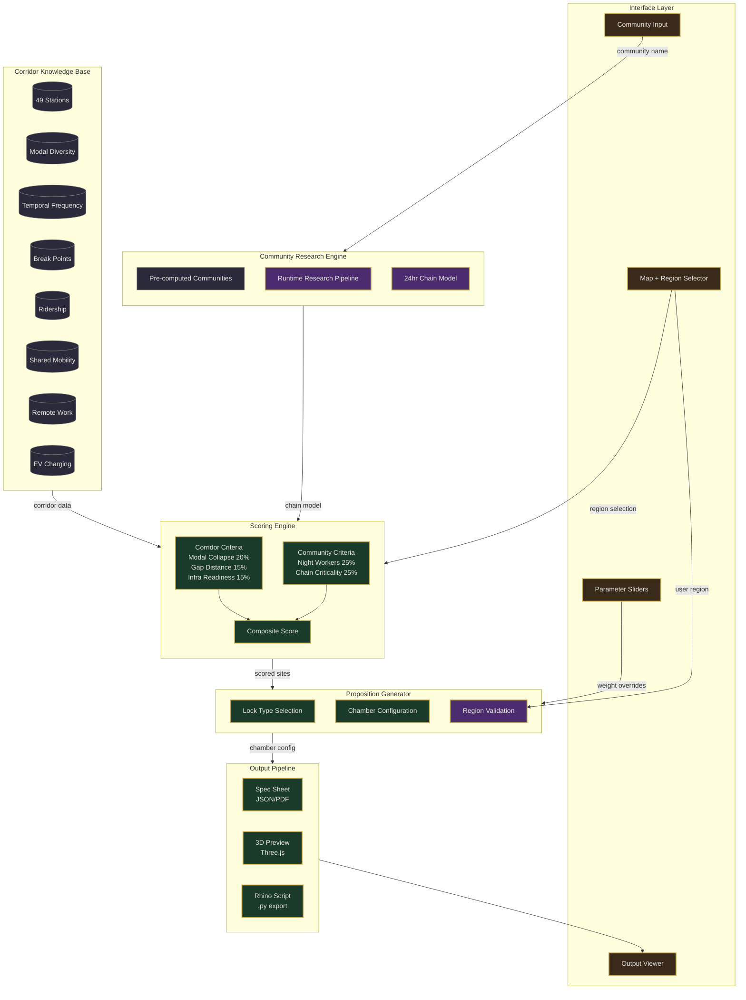
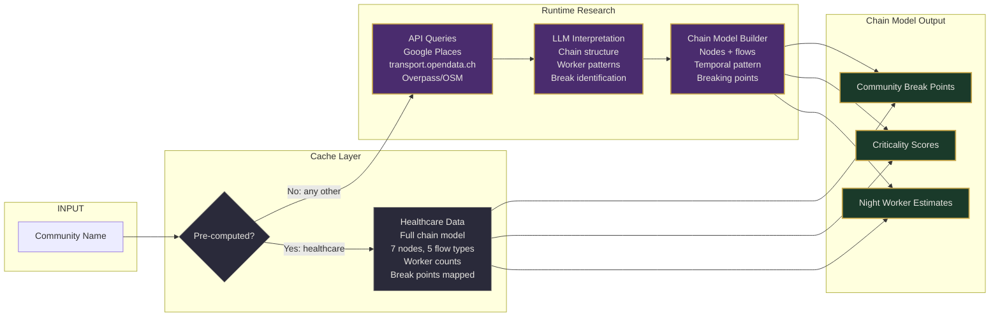
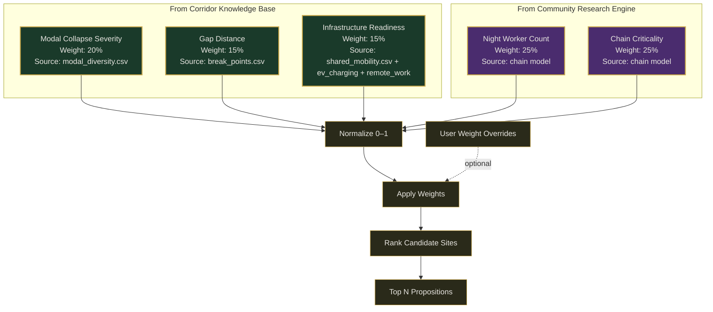
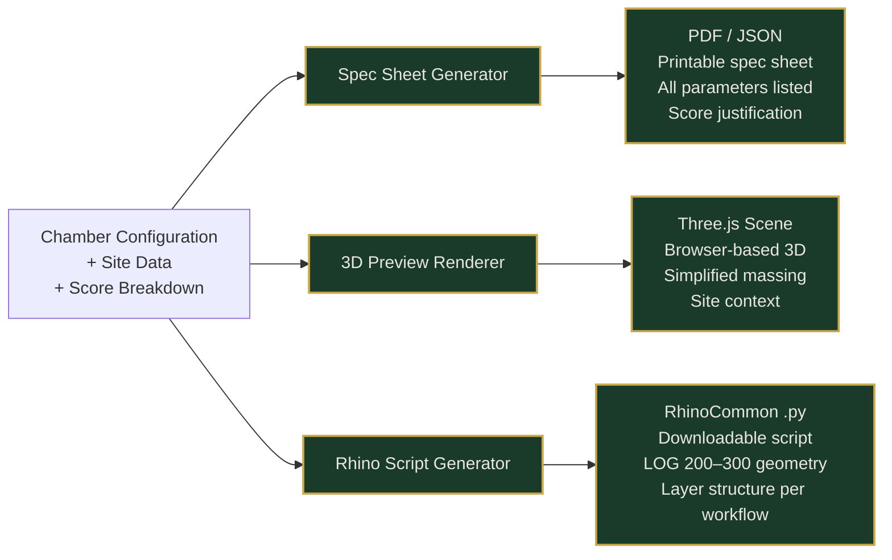
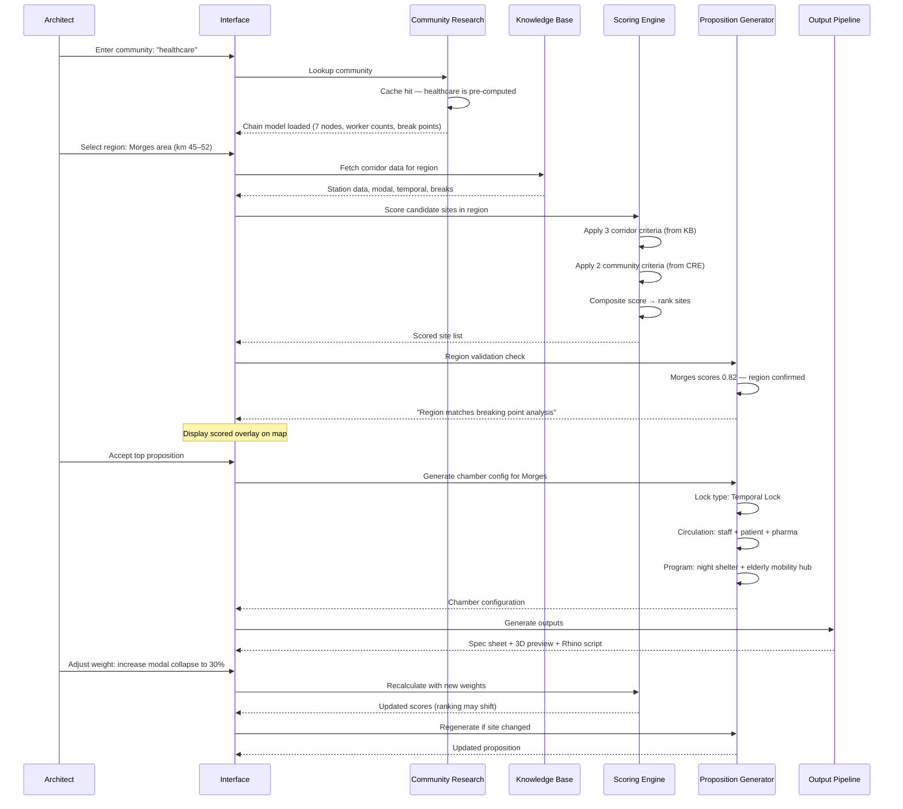
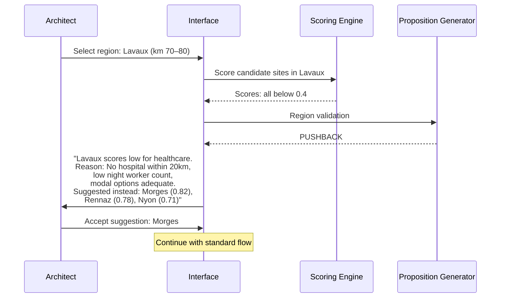
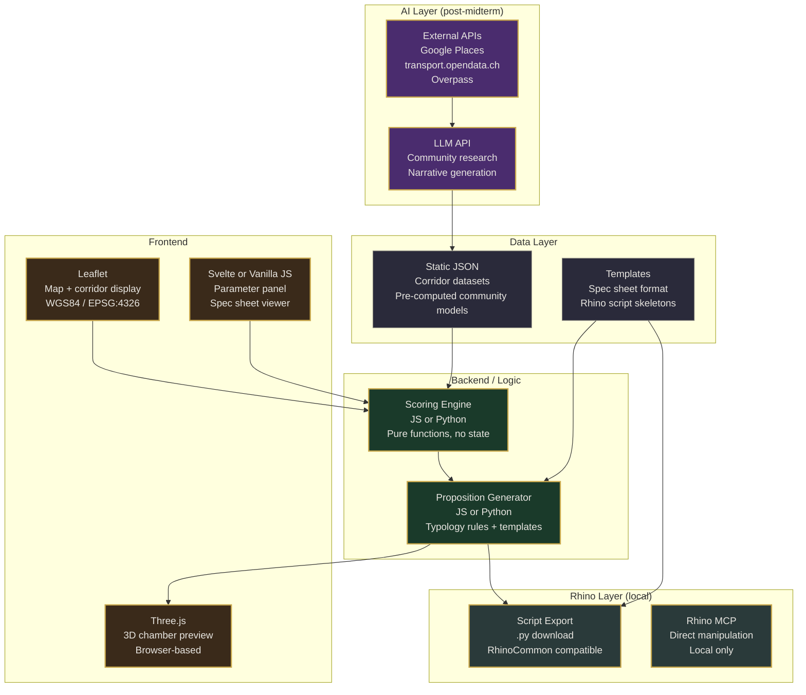
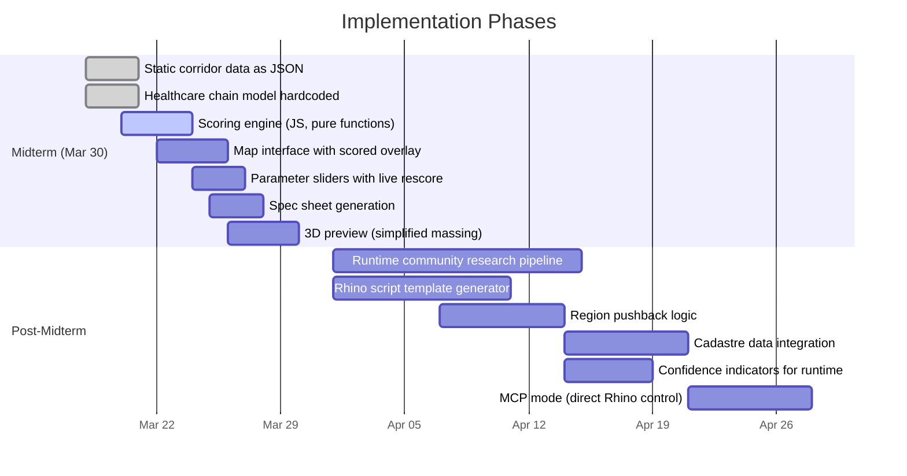

# System Architecture Overview

**Still on the Line — Relay-Lock Configurator**
Document 1 of 6 | March 2026

---

## 1. System Architecture

The configurator has six modules. Three are corridor-level (shared across all communities), two are community-specific, and one is the interface that ties them together.



**Legend**: Purple = AI-driven. Green = deterministic. Grey = static data. Brown = interface.

---

## 2. Module Descriptions

### 2.1 Corridor Knowledge Base

Static. Loaded once. Does not change per query.

| Dataset | Records | Role in Scoring |
|---------|---------|-----------------|
| 49-station corridor | 49 | Candidate site geography |
| Modal diversity | 49 | **Modal collapse severity** (20% weight) |
| Break points | 49 | **Gap distance** (15% weight) |
| Temporal frequency | 49 x 28 | Night service availability |
| Ridership | 174 | Demand validation |
| Shared mobility | 2,062 | **Infrastructure readiness** (15% weight) |
| Remote work places | 68 | Supporting infrastructure |
| EV charging | 194 | Supporting infrastructure |
| First/last trains | 49 | Dead window definition |
| Station crossref | 49 x 46 | Multi-source validation |

Source: `datasets/` directory. All verified through quality gates. Coordinate system: Swiss LV95 / EPSG:2056, converted to WGS84 for web display.

### 2.2 Community Research Engine

This is the hardest module to generalize. It answers: *What does this community's 24-hour chain look like, and where does it break?*



**Honest assessment of the runtime path:**

The healthcare community took weeks of research across multiple sessions to produce a 7-node chain model with specific worker counts, flow types, and breaking points. The runtime path compresses this into minutes. Quality tradeoffs:

| Aspect | Pre-computed (healthcare) | Runtime (other communities) |
|--------|--------------------------|----------------------------|
| Worker counts | Field-validated estimates | API-derived approximations |
| Chain structure | Manually identified nodes | LLM-inferred from business data |
| Break points | Cross-referenced with transport data | Best-guess from hours + locations |
| Confidence | High | Low-to-medium |
| Time to produce | ~20 hours of research | ~30 seconds of API + LLM |

The runtime path is useful for exploration and hypothesis generation. It should not be presented with the same confidence as pre-computed results. The interface must communicate this difference.

### 2.3 Scoring Engine

Deterministic once inputs are provided. The five criteria split cleanly into two sources.



**The generalization problem:** Modal collapse, gap distance, and infrastructure readiness are corridor properties. They work for any community. Night worker count and chain criticality are community properties. For healthcare, we have real numbers (300-400 night workers at Morges, 1,900-2,600 at CHUV). For bakeries, we would need to define: what counts as a "night worker" in this context? What makes one bakery's chain more "critical" than another's? The scoring framework holds, but the two community criteria need a community-specific definition layer.

### 2.4 Proposition Generator

Takes scored sites and produces chamber configurations. This is where the typology's vocabulary gets applied.

**9 Lock Types** (from the relay-lock research):

| Lock Type | Threshold | Example Site |
|-----------|-----------|--------------|
| Border Lock | Border / corridor | Geneva border zone |
| Cargo Lock | Cargo / city | Geneva North (ZIMEYSA) |
| Vertical Connector | Valley / hilltop | Nyon-Genolier |
| Temporal Lock | Last train / first train | Morges |
| Visibility Lock | Invisible / visible | Crissier-Bussigny |
| Gradient Dispatcher | Uphill / downhill | Lausanne CHUV |
| Altitude Lock | Mountain / lake | Montreux-Glion |
| Bridge Lock | Rail / off-rail | Rennaz |
| Logistics Engine | Generic threshold | Fallback type |

**Chamber configuration variables** (partially defined — needs formalization):

```
lock_type:           one of 9 types
circulation_types:   [staff, patient, cargo, emergency, public]
chamber_program:     list of spatial functions
threshold_sequence:  entry_state → chamber → exit_state
orientation:         corridor-parallel | corridor-perpendicular | vertical
scale:               LOG 200 (massing) | LOG 300 (detailed)
```

**Open question:** What is the minimal parameter set that fully defines a chamber? The existing Rhino scripts (Morges, CHUV, Rennaz) each handle site-specific geometry. Extracting a common parameter schema from these three scripts is a prerequisite for the proposition generator.

### 2.5 Output Pipeline

Three output formats from the same proposition data.



All three outputs are deterministic template-filling operations. No AI needed here.

**Rhino integration operates in three modes:**

| Mode | Where | Requirements | Audience |
|------|-------|--------------|----------|
| Preview | Browser (Three.js) | None | Everyone |
| Export | Download .py | Rhino installed | Architects |
| MCP | Direct Rhino control | Rhino + MCP running locally | Power users / development |

The existing 3 Rhino scripts follow the `00_Workflow_v04.md` conventions: LOG 200 for massing, LOG 300 for detail, layers organized by program, Swiss LV95 coordinates. The script generator must produce scripts that conform to this same convention.

### 2.6 Interface Layer

Not a dashboard. Not a visualization. A control surface.

```
+------------------------------------------------------------------+
|  COMMUNITY INPUT          |  MAP (Leaflet / WGS84)               |
|  [________________________] |  [ 101km corridor ]                 |
|  "healthcare"             |  [ 49 station markers ]              |
|                           |  [ scored heat overlay ]             |
|  REGION SELECTOR          |  [ user click → region ]             |
|  Click map or enter name  |  [ lock nodes highlighted ]          |
+---------------------------+                                      |
|  PARAMETER PANEL          |                                      |
|  Night workers    [===|==] 25%                                   |
|  Chain criticality[===|==] 25%                                   |
|  Modal collapse   [==|===] 20%                                   |
|  Gap distance     [=|====] 15%                                   |
|  Infra readiness  [=|====] 15%                                   |
+---------------------------+--------------------------------------+
|  PROPOSITION VIEWER                                              |
|  +------------------+  +------------------+  +-----------------+ |
|  | Spec Sheet       |  | 3D Preview       |  | Rhino Export    | |
|  | Lock: Temporal   |  | [Three.js canvas] |  | [Download .py]  | |
|  | Site: Morges     |  |                  |  |                 | |
|  | Score: 0.82      |  |                  |  |                 | |
|  +------------------+  +------------------+  +-----------------+ |
+------------------------------------------------------------------+
```

The interface must communicate:
- Whether results are pre-computed (high confidence) or runtime-generated (exploratory)
- Why a region was accepted or pushed back
- What changing a weight actually changes in the proposition

---

## 3. Request Lifecycle

What happens when an architect says: "I want to apply the typology to solve healthcare's problem in the Morges region."



**Alternate path — region pushback:**



---

## 4. AI vs. Deterministic Boundary

This is the most important diagram in the document.

```mermaid
graph LR
    subgraph AI_ZONE["AI Zone — Input Processing"]
        direction TB
        A1[Community chain research<br/>Understanding 24hr patterns]
        A2[Breaking point identification<br/>Interpreting where chains fail]
        A3[Region validation<br/>Reasoning about match quality]
        A4[Narrative generation<br/>Explaining propositions]
    end

    subgraph BOUNDARY["Handoff: Chain Model"]
        direction TB
        B1[Worker counts per site]
        B2[Criticality scores per site]
        B3[Break point locations]
        B4[Flow type definitions]
    end

    subgraph DETERMINISTIC_ZONE["Deterministic Zone — Everything Else"]
        direction TB
        D1[Scoring: 5 criteria weighted sum]
        D2[Lock type selection: highest-scoring type]
        D3[Weight adjustment: recalculation]
        D4[Spec sheet: template + data]
        D5[3D preview: parametric geometry]
        D6[Rhino script: template + parameters]
    end

    AI_ZONE --> BOUNDARY
    BOUNDARY --> DETERMINISTIC_ZONE

    classDef ai fill:#4a2c6e,stroke:#c9a84c,stroke-width:2px,color:#e8e6e1
    classDef boundary fill:#3a3a1a,stroke:#c9a84c,stroke-width:3px,color:#e8e6e1
    classDef det fill:#1a3a2a,stroke:#c9a84c,stroke-width:2px,color:#e8e6e1

    class A1,A2,A3,A4 ai
    class B1,B2,B3,B4 boundary
    class D1,D2,D3,D4,D5,D6 det
```



**The key insight: AI is heaviest at the input boundary.** Once a community's 24-hour chain is mapped to worker counts, criticality scores, and break point locations, everything downstream is a weighted sum, a template fill, or a parametric geometry operation.

**Consequence for midterm (March 30):** The demo does not require real-time AI. Hardcode the healthcare chain model as the pre-computed input. The entire deterministic pipeline runs without any LLM calls. Runtime community research is a post-midterm feature.

---

## 5. Tech Stack



**Technology choices are not locked.** The critical constraint is that the deterministic pipeline must work as a standalone static site (no server required) for the midterm demo. The AI layer and Rhino MCP are additive capabilities.

**Candidate stack for midterm:**
- Single HTML page with embedded JS (like the existing prototypology explorer)
- Corridor data as static JSON (converted from CSVs in `datasets/`)
- Healthcare chain model as static JSON (from `prototypology_content.json`)
- Leaflet for map, Three.js for 3D preview, vanilla JS for scoring + sliders
- No backend, no API calls, no build step

---

## 6. Critical Issues

### 6.1 Community Criteria Generalization

The scoring framework's 3 corridor criteria (modal collapse, gap distance, infrastructure readiness) transfer to any community because they describe the corridor, not the community. The 2 community criteria (night worker count, chain criticality) require community-specific definitions.

For healthcare, "night worker count" means staff on shift between 00:30-05:00. For bakeries, it might mean bakers starting at 03:00. For logistics, it might mean warehouse workers on rotating shifts. The *metric shape* is similar (how many people are stranded during the dead window) but the *data source and interpretation* differ completely.

**Proposed abstraction:** Define the community criteria interface as:
- `stranded_worker_count(site, time_window) -> int` — how many community members are cut off from transport at this site during this window
- `chain_break_severity(site) -> float 0-1` — how badly does losing this site's connectivity damage the community's chain

Any community research (pre-computed or runtime) must produce functions matching this interface. The scoring engine does not need to know whether the community is healthcare or bakeries — it receives the same shaped inputs.

### 6.2 Runtime Research Quality

Compressing weeks of research into a runtime query will produce lower-quality results. Strategies to manage this:

1. **Confidence indicator**: Every runtime result carries a confidence score. Display prominently.
2. **Source transparency**: Show the architect what data was found and what was estimated.
3. **Progressive refinement**: Allow saving and manually correcting runtime research results, building the cache over time.
4. **Guardrails**: If the runtime research finds fewer than N data points, say so. Do not hallucinate precision.

### 6.3 Missing Data: Cadastre

The system proposes sites but does not currently know where you can and cannot build. Cadastre data (land use zones, building regulations, protected areas) from the Canton of Vaud's geoportal would add a boolean filter: is this site even buildable?

Without cadastre data, the system proposes sites based on need and infrastructure, but an architect must manually verify buildability. Flag this in every spec sheet.

### 6.4 Chamber Parameter Formalization

The three existing Rhino scripts (Morges, CHUV, Rennaz) each encode site-specific logic. To generate scripts for arbitrary sites, we need a common parameter schema. Extracting this requires:

1. Audit the 3 scripts for shared variables vs. site-specific overrides
2. Define the minimal parameter set: footprint, height, lock orientation, circulation count, program areas
3. Build a template script that accepts parameters and generates geometry
4. Test on a 4th site (not one of the originals) to validate generalization

This is a prerequisite for the proposition generator's Rhino export. For midterm, the three existing scripts can be offered as-is for their respective sites.

### 6.5 The 9-Node vs. N-Node Question

The current research identifies 9 lock types mapped to specific sites along the healthcare chain. When a different community is analyzed, the lock types may apply but the sites will differ. The system must support:
- Fixed vocabulary of lock types (the 9 types are the typology)
- Variable number of nodes per community (healthcare has 7 populated nodes, others may have 3 or 12)
- Variable site assignments (a bakery chain might need a Temporal Lock at Vevey, not Morges)

The 9 lock types are the contribution. The specific sites are instances.

---

## 7. Phasing



**Midterm deliverable:** A static-site configurator that takes healthcare as the community, shows scored sites on the corridor map, lets the architect adjust weights, and generates a spec sheet + simplified 3D preview for the top proposition. No server. No AI calls. Deterministic pipeline only.

**Post-midterm:** Add runtime community research, Rhino script generation, region pushback, and cadastre filtering. Each feature is additive — the deterministic core does not change.
