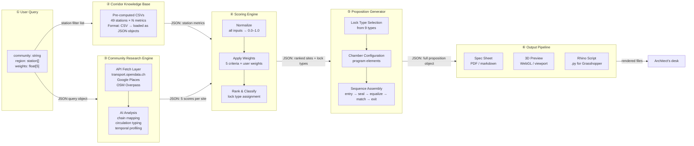
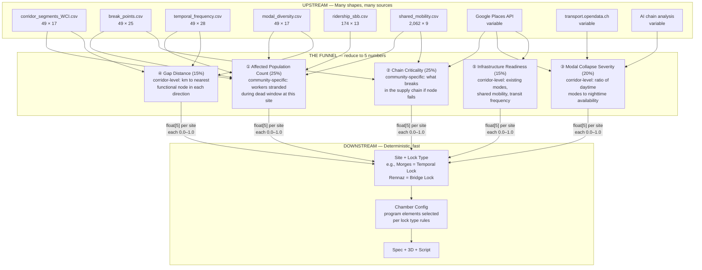
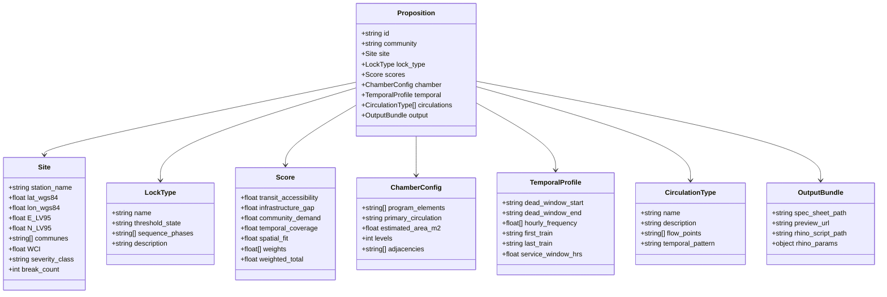
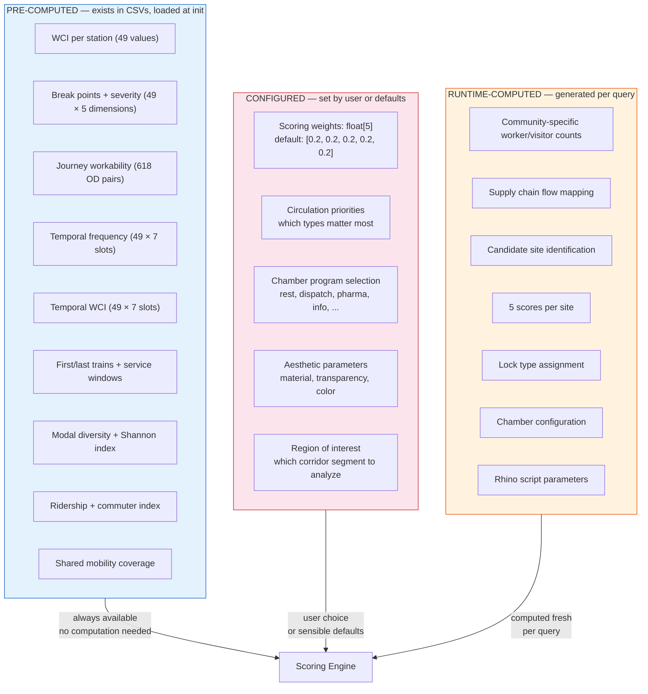

# Data Flow — "Still on the Line"

**Architecture Document 2 of 6**
Tool for architects to apply a relay-lock typology to sites along a 101km Swiss corridor.

---

## 1. Data Source Map

Where every piece of data originates. Four source classes: local CSV (pre-computed, verified), external API (fetched at runtime), AI-generated (community research engine), and user input (interface).

```mermaid
graph TB
    subgraph LOCAL["LOCAL CSV — Corridor Knowledge Base"]
        direction TB
        WCI["corridor_segments_WCI.csv<br/>49 stations × 17 cols<br/>WCI range: 0.0003–0.6431"]
        BP["break_points.csv<br/>49 stations × 25 cols<br/>5 break dimensions + severity"]
        JW["journey_workability.csv<br/>618 journeys × 20 cols<br/>15% PRIME / 12% WORKABLE / 39% MARGINAL / 32% NOT_WORKABLE"]
        TF["temporal_frequency.csv<br/>49 stations × 28 cols<br/>7 time slots, trains/hr per slot"]
        TWCI["temporal_WCI.csv<br/>49 stations × ~55 cols<br/>TWCI per station × 7 slots"]
        FLT["first_last_trains.csv<br/>49 stations × 10 cols<br/>service windows: 0h to 21.3h"]
        MD["modal_diversity.csv<br/>49 stations × 17 cols<br/>11 mode types, Shannon index"]
        SF["service_frequency_v2.csv<br/>49 stations × 15 cols<br/>trains/hr, IC vs regional"]
        RS["ridership_sbb.csv<br/>174 records × 13 cols<br/>daily pax, commuter index"]
        SM["shared_mobility.csv<br/>2,062 records × 9 cols<br/>8 providers"]
    end

    subgraph API["EXTERNAL APIs — Runtime Fetch"]
        direction TB
        TAPI["transport.opendata.ch<br/>schedules, connections<br/>rate: 0.35s min between calls"]
        GAPI["Google Places API<br/>POIs, reviews, hours<br/>standard rate limits"]
        DAPI["data.geo.admin.ch<br/>WMS + REST<br/>cadastre, terrain, buildings"]
        SAPI["sharedmobility.ch<br/>REST API<br/>real-time availability"]
        OAPI["Overpass / OSM<br/>amenities, land use<br/>no strict rate limit"]
    end

    subgraph AI["AI-GENERATED — Community Research Engine"]
        direction TB
        CHAIN["supply chain analysis<br/>flow mapping per community<br/>e.g., 8 flows for healthcare"]
        SITES["candidate site identification<br/>scored on 5 criteria<br/>e.g., 24 → top 9"]
        CIRC["circulation type definition<br/>community-specific movement patterns<br/>e.g., staff / patient / cargo / home care"]
        TEMP["temporal profile extraction<br/>dead windows, peak patterns<br/>e.g., 01:30–03:30 = zero transport"]
    end

    subgraph USER["USER INPUT — Interface"]
        direction TB
        COMM["community identifier<br/>string: 'healthcare', 'bakery', etc."]
        REGION["region of interest<br/>corridor segment or commune list"]
        WEIGHTS["scoring weights<br/>5 floats, default: equal (0.2 each)"]
        PREFS["chamber preferences<br/>program element selection"]
    end

    LOCAL --> KB[(Corridor<br/>Knowledge Base)]
    API --> CRE[Community<br/>Research Engine]
    AI --> CRE
    USER --> INTERFACE[Interface]
```

## 2. End-to-End Data Flow

From user query to output spec sheet. Each arrow is annotated with the data format crossing that boundary.

## 3. The Scoring Funnel

The most critical data transformation. Everything upstream exists to produce exactly 5 numbers per candidate site. Everything downstream consumes the scored and typed result.

## 4. Typology Schema — The Proposition Object

What a completed proposition looks like as structured data. This is the central data object that the Proposition Generator produces and the Output Pipeline consumes.

### The 9 Lock Types (from v2 paper)

| Lock Type | Threshold State | Example Site |
|-----------|----------------|--------------|
| Border Lock | Border ↔ Corridor | Lancy-Pont-Rouge (km 4) |
| Cargo Lock | Cargo ↔ City | Geneva North Industrial (km 8) |
| Altitude Lock | Valley ↔ Hilltop | Nyon-Genolier (km 25), Montreux-Glion (km 85) |
| Temporal Lock | Last train ↔ First train | Morges (km 48) |
| Visibility Lock | Invisible ↔ Visible | Crissier-Bussigny (km 58-62) |
| Gradient Dispatcher | Uphill ↔ Downhill | Lausanne CHUV (km 65) |
| Gap Relay | Gap ↔ Gap | Vevey (km 80) |
| Bridge Lock | Rail ↔ Off-rail | Rennaz (km 89) |
| Logistics Engine | Machine ↔ Civic | Crissier-Bussigny (compound with Visibility) |

## 5. Community Data Comparison

What exists for healthcare (weeks of research) versus what must be generated for a new community at runtime.

```mermaid
graph LR
    subgraph HEALTHCARE["Healthcare — Pre-Researched"]
        direction TB
        H1["8 supply chain flows mapped<br/>medication, food, staff, patients,<br/>postal, lab/blood, waste, emergency"]
        H2["24 candidate sites scored<br/>→ top 9 selected"]
        H3["4 circulation types defined<br/>staff, patient, cargo, home care"]
        H4["Dead window: 01:30–03:30<br/>flanking hours mapped"]
        H5["CHUV, Morges, Rennaz<br/>detailed site analysis"]
    end

    subgraph BAKERY["Bakery — Runtime Generated"]
        direction TB
        B1["? supply chain flows<br/>flour, ingredients, finished goods,<br/>staff, waste — AI-estimated"]
        B2["? candidate sites<br/>Google Places + OSM query<br/>→ scored on same 5 criteria"]
        B3["? circulation types<br/>AI-inferred from chain analysis<br/>likely: staff, delivery, customer"]
        B4["Temporal from transport data<br/>+ Google popular hours<br/>baking shift: ~03:00–06:00"]
        B5["No site-specific research<br/>relies on corridor base data<br/>+ API enrichment"]
    end

    subgraph SHARED["Shared — Corridor Knowledge Base"]
        direction TB
        S1["49 stations × WCI"]
        S2["49 stations × break points"]
        S3["49 stations × temporal freq"]
        S4["49 stations × modal diversity"]
        S5["618 journey workability records"]
        S6["174 ridership records"]
        S7["2,062 shared mobility points"]
    end

    SHARED --> HEALTHCARE
    SHARED --> BAKERY

    style HEALTHCARE fill:#e8f5e9,stroke:#2e7d32
    style BAKERY fill:#fff3e0,stroke:#e65100
    style SHARED fill:#e3f2fd,stroke:#1565c0
```

### The Gap

| Data Layer | Healthcare | New Community (runtime) |
|-----------|-----------|----------------------|
| Supply chain flows | 8 flows, manually researched | AI-estimated from community type |
| Candidate sites | 24 scored, 9 selected | API query + AI scoring |
| Circulation types | 4 defined with spatial logic | AI-inferred, 2-4 types |
| Temporal profile | Field-validated dead window | Derived from transport data + API hours |
| Site-specific detail | Architect-level analysis | Corridor base data only |
| Confidence | High | Medium -- sufficient for proposition, not for construction |

## 6. Format Specifications

What format data takes at each stage of the pipeline.

```mermaid
flowchart LR
    subgraph STAGE1["Stage 1: Storage"]
        CSV["CSV files<br/>UTF-8, comma-delimited<br/>WGS84 + LV95 coordinates<br/>city101_ prefix"]
    end

    subgraph STAGE2["Stage 2: Loaded"]
        JSON1["JSON objects<br/>station-keyed dictionary<br/>{ 'Morges': { WCI: 0.32, ... } }<br/>loaded at app init"]
    end

    subgraph STAGE3["Stage 3: Query"]
        JSON2["JSON query<br/>{ community, region, weights }<br/>from interface"]
    end

    subgraph STAGE4["Stage 4: Enrichment"]
        JSON3["JSON arrays<br/>API responses normalized<br/>to common schema<br/>{ id, name, lat, lon, ... }"]
    end

    subgraph STAGE5["Stage 5: Scored"]
        JSON4["JSON scored sites<br/>{ station, scores[5],<br/>  weighted_total,<br/>  lock_type }"]
    end

    subgraph STAGE6["Stage 6: Proposition"]
        JSON5["Proposition object<br/>(see class diagram)<br/>complete config"]
    end

    subgraph STAGE7["Stage 7: Output"]
        PDF["Spec sheet<br/>PDF or HTML"]
        WEBGL["3D preview<br/>WebGL / Three.js"]
        PY["Rhino script<br/>.py (RhinoCommon)<br/>parametric geometry"]
    end

    CSV -->|"parse + index<br/>by station_name"| JSON1
    JSON1 -->|"filter by<br/>region"| JSON2
    JSON2 -->|"API calls<br/>+ AI analysis"| JSON3
    JSON3 -->|"normalize<br/>+ merge"| JSON4
    JSON4 -->|"weight<br/>+ rank"| JSON5
    JSON5 -->|"lock rules<br/>+ chamber logic"| JSON6[JSON5]
    JSON6 -->|"render"| PDF
    JSON6 -->|"render"| WEBGL
    JSON6 -->|"template"| PY
```

### Field-Level Format Table

| Stage | Key Fields | Types | Constraints |
|-------|-----------|-------|-------------|
| CSV Storage | `station_name` | string | Must match canonical 49 |
| | `lat_wgs84`, `lon_wgs84` | float | lat: 46.1-46.6, lon: 6.0-7.1 |
| | `E_LV95`, `N_LV95` | float | E: 2496000-2565000, N: 1130000-1155000 |
| | `WCI` | float | 0.0-1.0 |
| JSON Loaded | keyed by `station_name` | dict | All 49 stations present |
| Query | `community` | string | Non-empty |
| | `region` | string[] | Subset of 49 stations or commune names |
| | `weights` | float[5] | Each >= 0, sum to 1.0 |
| Scored | `scores` | float[5] | Each 0.0-1.0 |
| | `lock_type` | string | One of 9 types |
| | `weighted_total` | float | 0.0-1.0 |
| Proposition | Full object | see class diagram | All fields populated |
| Rhino Script | `rhino_params` | dict | LV95 coordinates, dimensions in meters |

---

## 7. Computed vs. Configured vs. Pre-Computed

Three categories of data, clearly separated by when and how they are determined.

## 8. Data Volume and Performance Characteristics

| Dataset | Records | Load Time | Update Frequency |
|---------|---------|-----------|-----------------|
| corridor_segments_WCI | 49 | <1ms (local CSV) | Never (static) |
| break_points | 49 | <1ms | Never |
| journey_workability | 618 | <5ms | Never |
| temporal_frequency | 49 | <1ms | Never |
| temporal_WCI | 49 | <1ms | Never |
| first_last_trains | 49 | <1ms | Never |
| modal_diversity | 49 | <1ms | Never |
| service_frequency_v2 | 49 | <1ms | Never |
| ridership_sbb | 174 | <1ms | Yearly (SBB publishes annually) |
| shared_mobility | 2,062 | <10ms | Could refresh via API |
| **Total local** | **~3,200** | **<20ms** | **Essentially static** |

| Runtime Operation | Latency | Bottleneck |
|-------------------|---------|------------|
| transport.opendata.ch query | 0.5-2s per call | Rate limit: 0.35s min |
| Google Places search | 0.3-1s per call | Quota per key |
| OSM Overpass query | 1-5s per query | Query complexity |
| AI community analysis | 5-30s | LLM inference |
| Scoring (deterministic) | <10ms | None |
| Proposition generation | <50ms | None |
| Rhino script generation | <100ms | Template rendering |

The corridor knowledge base loads entirely in under 20ms. The bottleneck is always community-specific data generation: API calls and AI analysis. Once the 5 scores exist, everything downstream is instantaneous.

---

## Critical Observations

**The corridor knowledge base is the project's biggest asset.** 49 stations, each characterized across dozens of metrics, with full temporal resolution (7 time slots), modal diversity, break point severity, and journey workability. This is months of verified data collection that no runtime process can replicate.

**Community-specific data is the bottleneck.** Healthcare research took weeks of manual investigation to map 8 supply chain flows, identify 24 candidate sites, and define 4 circulation types. The Community Research Engine can approximate this for new communities using AI and APIs, but the depth will always be lower. The system is honest about this: healthcare propositions carry high confidence, runtime-generated propositions carry medium confidence.

**The scoring engine needs exactly 5 numbers per candidate site.** Every upstream component -- the corridor knowledge base, the API enrichment, the AI analysis -- exists to produce those 5 normalized floats. This is the narrowest point in the pipeline, and it is intentionally narrow. Complex upstream data becomes tractable. Downstream logic becomes deterministic.

**Downstream of scoring, everything is deterministic and fast.** Lock type assignment follows threshold rules. Chamber configuration follows lock type rules. Rhino script generation follows chamber configuration. No AI, no API calls, no ambiguity. An architect can trace exactly why a proposition looks the way it does by examining the 5 scores and their weights.

**Format discipline matters.** All local data uses the `city101_` prefix, carries both WGS84 and LV95 coordinates, and passes through the project's data verification pipeline before reaching `datasets/`. Runtime data follows the same schema constraints. The Proposition object is the single source of truth for everything the output pipeline renders.
