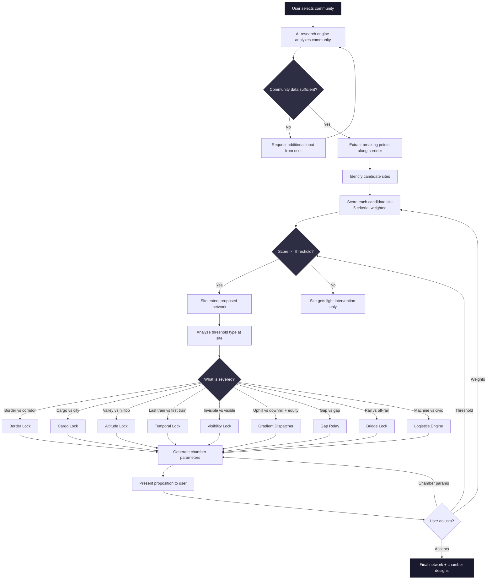
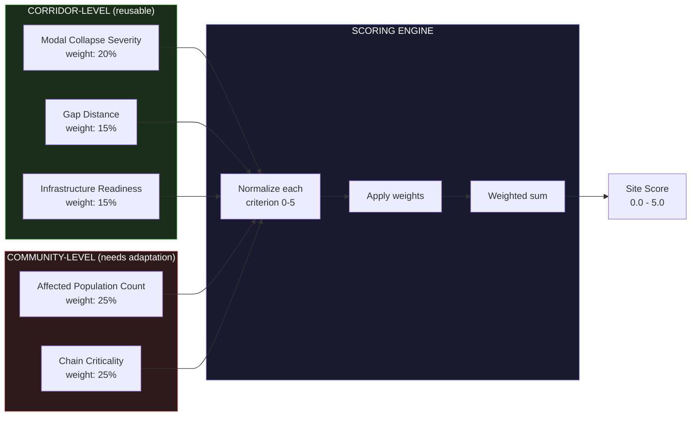
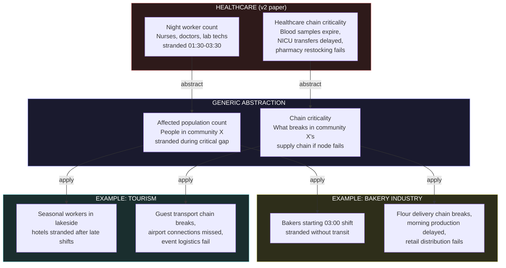
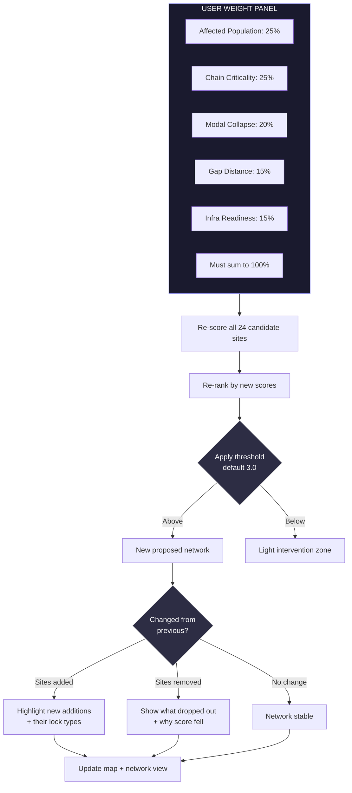
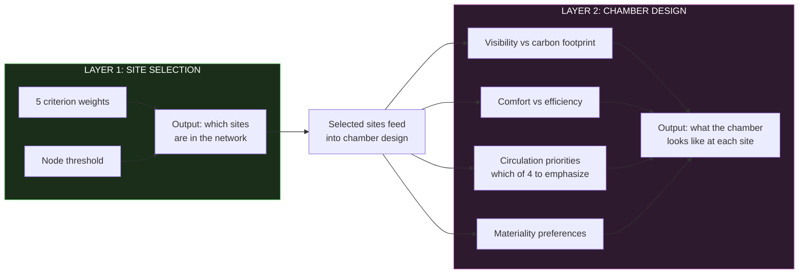
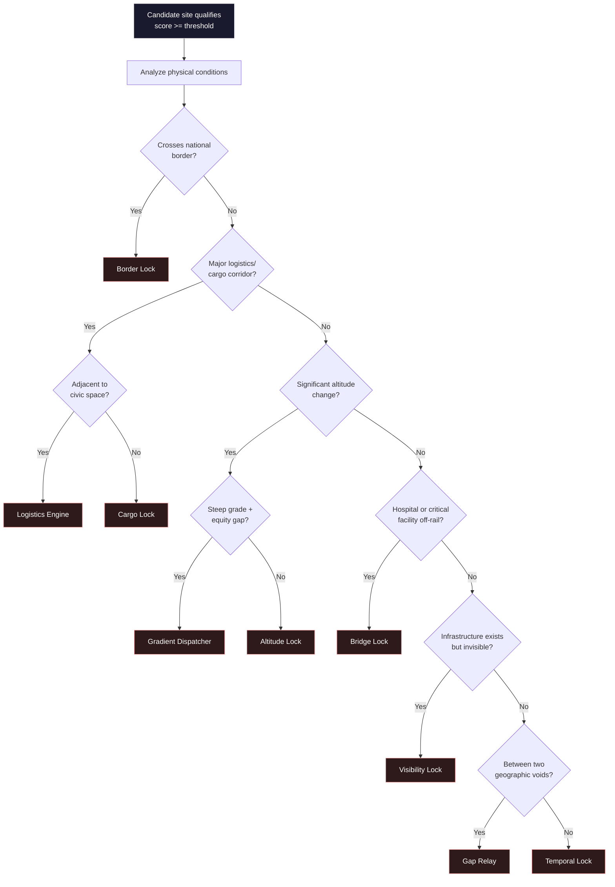
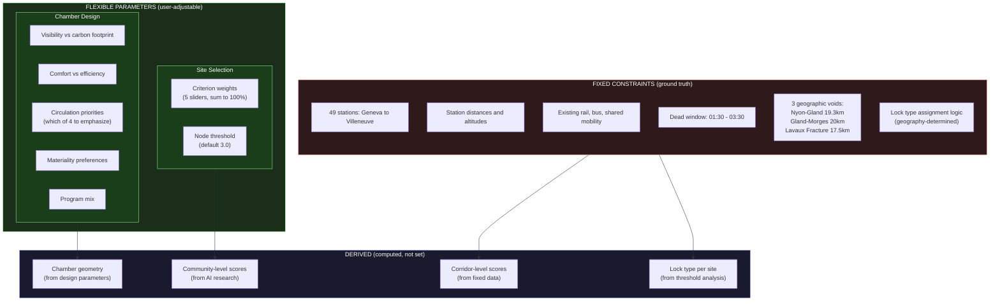
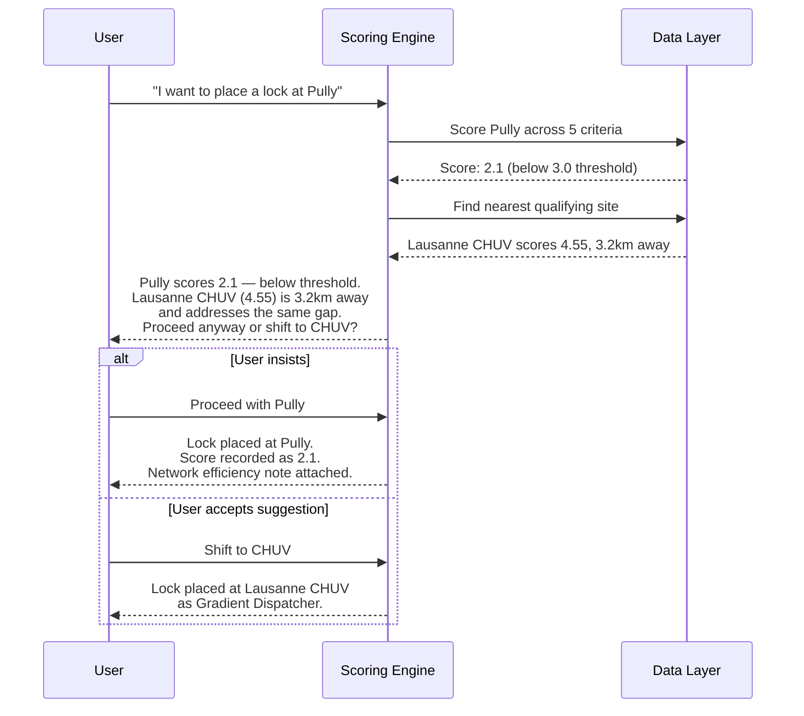
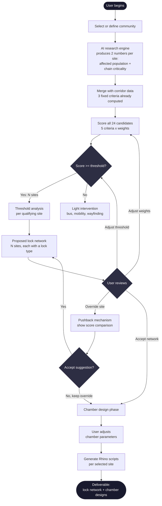

# Decision Logic

**Architecture Document 3 of 6** — Still on the Line
How the system decides which lock type fits, how scoring works, how user adjustments modify propositions.

---

## 1. Decision Tree: User Input to Lock Type Assignment

The full path from a user selecting a community to receiving a proposed lock network.

Two things determine the outcome independently:
- **Which sites make the network** is determined by scoring (community-dependent).
- **Which lock type each site gets** is determined by threshold analysis (geography-dependent).

A user changing weights reshuffles which sites qualify. It never changes what lock type a qualifying site receives.

---

## 2. Scoring Pipeline

How raw data becomes a site score, and how the pipeline generalizes from healthcare to any community.

### Normalization rules

Each criterion maps raw data to a 0-5 integer scale. The mapping is criterion-specific:

| Score | Modal Collapse | Gap Distance | Infra Readiness | Affected Population | Chain Criticality |
|-------|---------------|-------------|-----------------|--------------------|--------------------|
| 0 | Ratio < 1.2 | < 3 km | 5+ modes available | < 10 affected | No chain dependency |
| 1 | Ratio 1.2-1.5 | 3-5 km | 4 modes | 10-50 | Minor disruption |
| 2 | Ratio 1.5-2.0 | 5-8 km | 3 modes | 50-150 | Workaround exists |
| 3 | Ratio 2.0-3.0 | 8-12 km | 2 modes | 150-500 | Delayed service |
| 4 | Ratio 3.0-5.0 | 12-18 km | 1 mode | 500-1500 | Service interrupted |
| 5 | Ratio > 5.0 | > 18 km | 0 modes | > 1500 | Chain breaks completely |

The three corridor-level criteria use the same data and same scales regardless of community. The two community-level criteria require the AI research engine to produce raw numbers per candidate site, which then feed through the same normalization logic.

---

## 3. The Generalization Problem

The v2 paper's two community-specific criteria were healthcare-native. Generalization requires abstracting them without losing precision.

The abstraction holds because the underlying question is always the same: "How many people are stuck, and what breaks while they're stuck?" The community determines the nouns. The scoring framework provides the verbs.

What the AI research engine must produce for any new community:
1. **Per candidate site**: estimated count of affected people during the critical gap window.
2. **Per candidate site**: a chain criticality assessment — what downstream process fails, how severe, and whether workarounds exist.

These two numbers feed into the same normalization table and scoring engine. Everything else is corridor data that's already computed.

---

## 4. Weight Adjustment Flow

What happens when a user moves a slider.

### Two distinct adjustment layers

Weight adjustment operates on **site selection** only. It never touches chamber design. The system separates these cleanly:

A user adjusting weights in Layer 1 sees the map change (sites appear/disappear). A user adjusting parameters in Layer 2 sees the 3D model change (chamber form evolves). These are independent interactions that happen in sequence or in parallel, but they never cross.

---

## 5. Lock Type Assignment Matrix

What conditions at a site trigger what lock type. This is the threshold analysis — determined by geography and infrastructure, not by scoring.

### Assignment is deterministic, not scored

The decision tree above is evaluated top-to-bottom. A site gets the first lock type whose conditions it satisfies. This means:

- A border crossing with altitude change gets **Border Lock** (border condition takes priority).
- A cargo corridor adjacent to civic space gets **Logistics Engine** (the civic adjacency upgrades it from Cargo Lock).
- A site with no special geographic condition defaults to **Temporal Lock** — the pure dead-window problem that applies everywhere on the corridor.

The priority ordering reflects severity: border failures and logistics disconnections are harder to solve than pure temporal gaps, so they get specialized lock types first.

### Validation against v2 results

| Site | Conditions present | Assigned lock | v2 match? |
|------|-------------------|---------------|-----------|
| Lausanne CHUV | Steep grade, equity gap, hospital | Gradient Dispatcher | Yes |
| Morges Hospital Gap | Dead window, hospital nearby but not off-rail | Temporal Lock | Yes |
| Crissier-Bussigny-Ecublens | Logistics corridor + civic adjacency / hidden infra | Visibility Lock / Logistics Engine | Yes |
| Rennaz Hospital Island | Hospital off-rail | Bridge Lock | Yes |
| Lancy-Pont-Rouge | French border proximity | Border Lock | Yes |
| Nyon + Genolier | Major altitude change to Genolier clinic | Altitude Lock | Yes |
| Vevey Mid-Gap Relay | Between Lavaux Fracture voids | Gap Relay | Yes |
| Geneva North Industrial Belt | Cargo/logistics corridor, no civic adjacency | Cargo Lock | Yes |
| Montreux-Glion | Altitude change (funicular territory) | Altitude Lock | Yes |

All 9 v2 assignments are reproducible through the decision tree. This validates the tree's ordering.

---

## 6. Fixed vs. Flexible Parameter Diagram

What the system treats as ground truth versus what the user can adjust.

### The pushback mechanism

When a user selects a region that doesn't match the data, the system uses the fixed constraints to explain why:

The pushback is informational, never blocking. The user always has the final say. But the system makes the cost visible: a low-scoring site means the intervention addresses less need per resource spent.

---

## 7. Full Decision Pipeline: End to End

Combining all the above into one view.

---

## Technical Notes

### On the 1:1 problem (9 types for 9 nodes)

The current taxonomy has 9 lock types assigned to 9 nodes. This appears suspiciously fitted. Two observations temper the concern:

1. **Two nodes share a type.** Nyon + Genolier and Montreux-Glion both receive Altitude Lock. This demonstrates the type is reusable across sites with the same threshold condition. Crissier-Bussigny-Ecublens receives both Visibility Lock and Logistics Engine, suggesting some sites carry compound conditions.

2. **The types emerged from threshold analysis, not from the sites.** Each type corresponds to a distinct kind of severance (border, altitude, temporal, etc.). A new corridor would likely surface a subset of these same types — the geography is different, but the categories of failure are finite.

The real test comes when the tool is applied to a new community. If the same 9 types cover the new community's sites without inventing new ones, the taxonomy holds. If not, it needs extension — and the architecture should support adding lock types without restructuring the scoring engine.

### On the 3.0 threshold

The 3.0 cutoff was determined empirically from the healthcare analysis. It produced a natural break in the score distribution: a visible gap between the 9th-ranked site (3.10) and the 10th (2.85). This suggests the threshold reflects real structure in the data, not an arbitrary line.

For new communities, the threshold should be re-examined. The system defaults to 3.0 but allows user adjustment. A histogram of all candidate scores, with the current threshold marked, should be visible in the interface so users can see where the natural break falls for their community.

### On scoring edge cases

- **Tied scores**: Sites with identical scores are ordered by gap distance (larger gap = higher priority). Rationale: larger gaps leave more people without coverage.
- **Zero-weight criteria**: If a user sets a criterion weight to 0%, that criterion is excluded entirely. The remaining weights are renormalized to sum to 100%. The system warns that reducing to fewer criteria increases sensitivity to the remaining ones.
- **All sites below threshold**: If no site scores above threshold after weight adjustment, the system warns that the community may not have corridor-scale severance, and suggests lowering the threshold or reconsidering the community definition.
- **All sites above threshold**: If all 24 sites score above threshold, the system warns that the threshold may be too low for meaningful differentiation, and suggests raising it or examining whether the community-level data has sufficient variance.

### On the AI research engine's role

The research engine is the only non-deterministic component in the scoring pipeline. Everything else — corridor data, normalization scales, weight application, threshold comparison, lock type assignment — is mechanical. The research engine's job is narrow and well-defined: produce two numbers per candidate site (affected population count, chain criticality score) with supporting evidence.

Quality of output depends entirely on the quality of these two numbers. The system should surface the research engine's confidence level and source material so users can judge whether to trust the scores or override them.
