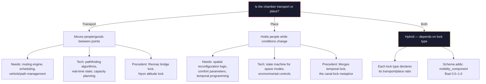
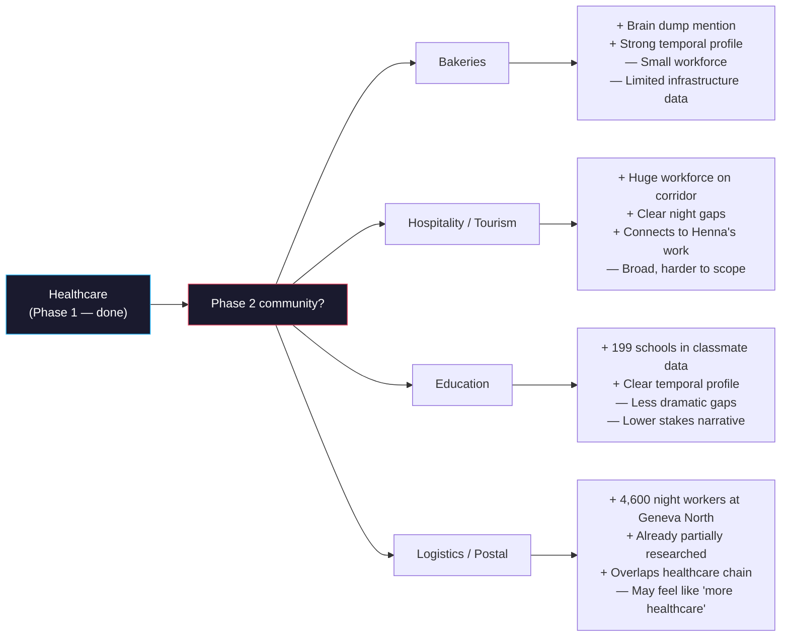
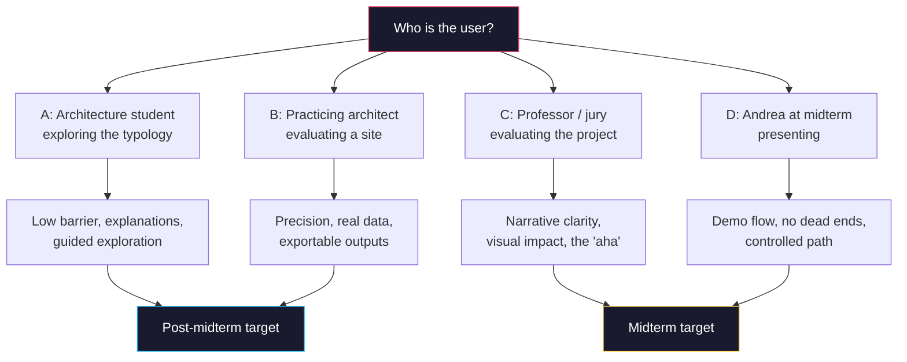
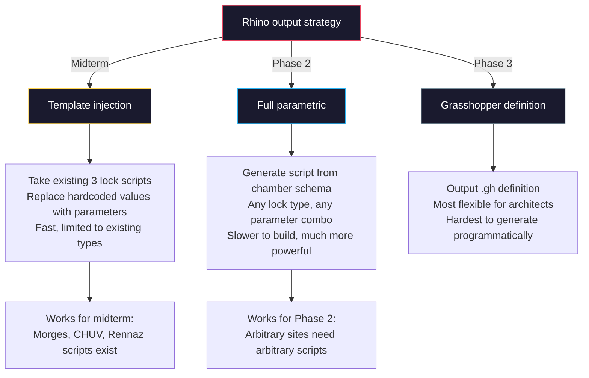

# Open Questions

Document 6 of 6 — "Still on the Line" Architecture Series

These are the things that need human decisions before implementation can proceed. Some are architectural (the building kind), some are technical, some are both. Each question states what it blocks, proposes a default, and gives a deadline.

---

## 1. Typology Definition

Blocks: scoring engine, proposition generator, Rhino export pipeline.

### Q1.1 — What is the minimal parameter set for a chamber?

The v2 paper describes 9 lock concepts qualitatively. For parametric generation, we need a formal schema — a finite set of numbers and enums that define any chamber.

**Proposed minimum schema:**

| Parameter | Type | Example values |
|-----------|------|----------------|
| Footprint | width x depth (m) | 12 x 8, 20 x 15 |
| Height | levels x floor-to-floor (m) | 2 x 3.5 |
| Program elements | enum list | rest pods, dispatch screen, pharma dispensing, viewing gallery, kitchen, bike dock, bus bay, information wall, charging stations |
| Circulation count | int 1–4 | From: staff, patient, cargo, home care |
| Lock sequence timing | durations (min) | entry → sealing → equalization → level-matching → exit |
| Orientation | degrees relative to transit axis | 0 = parallel, 90 = perpendicular |
| Transparency | % glass/open | 0–100 |
| Power source | enum | solar, grid, water, hybrid |

**What's uncertain:** Is lock sequence timing a spatial parameter or a programmatic one? If the chamber is a place (see Q1.2), timing describes how the space reconfigures — it needs physical expression. If it's transport, timing is a schedule.

**Why it matters:** Every downstream system — the scoring engine, the proposition generator, the Rhino export — consumes this schema. Get it wrong and we rebuild.

**Proposed default:** Use the 8 parameters above. Add parameters only when a specific lock type cannot be described without them.

**Decision deadline:** Before midterm prototype (March 28). The schema does not need to be final, but it needs to exist.

---

### Q1.2 — Is the chamber actual transport or a place?

This is the most consequential architectural question in the project.

The v2 paper leans toward "place" — the occupant is stationary, the space transitions around them, like a canal lock where the boat stays still. But at least two nodes imply transport: Rennaz (bridge lock = covered path spanning 2km) and Nyon (altitude lock = vertical connector across 400m).

**Proposed default:** Place-first, transport-optional. The core schema describes a place. Lock types that include a transport component (bridge lock, altitude lock) add a `mobility_component` field. This keeps the system simple for midterm while leaving room for the transport dimension later.

**Decision deadline:** Before midterm (March 28). This shapes the entire proposition generator.

---

### Q1.3 — Are the 9 lock types final, or should some merge/split?

Current taxonomy from v2:

| # | Lock Type | Node(s) |
|---|-----------|---------|
| 1 | Border Lock | Lancy-Pont-Rouge (km 4) |
| 2 | Cargo Lock | Geneva North Industrial (km 8) |
| 3 | Altitude Lock | Nyon-Genolier (km 25), Montreux-Glion (km 85) |
| 4 | Temporal Lock | Morges (km 48) |
| 5 | Visibility Lock / Logistics Engine | Crissier-Bussigny (km 58-62) |
| 6 | Gradient Dispatcher | Lausanne CHUV (km 65) |
| 7 | Gap Relay | Vevey (km 80) |
| 8 | Bridge Lock | Rennaz (km 89) |

The v2 paper defines 9 nodes with 8 distinct lock types (Altitude Lock is used twice — Nyon and Montreux). The existing prototypology explorer only implemented 7 of the 9. The full 9-node network from the v2 paper is the target. Some overlaps:

- **Visibility Lock** (Crissier) and **Cargo Lock** (Geneva North) both deal with invisible logistics infrastructure. Could one be a subtype of the other?
- **Gradient Dispatcher** (CHUV) and **Altitude Lock** (Montreux) both resolve vertical separation. CHUV is topographic gradient within a city; Montreux is mountain vs. lake altitude. Similar mechanism, different scale.
- **Vertical Connector** (Nyon) also deals with altitude — 400m between valley hospital and hilltop clinic.

**Proposed default:** Keep the current taxonomy frozen for midterm. Mark "may consolidate" in the schema. A clean taxonomy matters for the tool's generalizability, but refinement can happen in Phase 2 when more communities test the types.

**Decision deadline:** Post-midterm. No action needed before March 30, but worth a 10-minute conversation with Huang about whether the types are "archetypes" or "instances."

---

## 2. Data and Scope

Blocks: community research engine, corridor knowledge base, generalization proof.

### Q2.1 — Which community comes second after healthcare?

The tool claims to work for any community, not just healthcare. Proving that requires at least one more. Options ranked by data availability and narrative strength:

**Proposed default:** Hospitality/tourism. Largest workforce after healthcare on the corridor, connects to Henna's cultural and thermal comfort layers, and has obvious dead-window gaps (restaurant workers finishing at midnight, hotel night shifts). Bakeries are charming but too small to stress-test the system.

**Decision deadline:** Before Phase 2 kickoff (post-midterm). For midterm, healthcare alone is sufficient. But naming the second community in the presentation shows the tool is generalizable.

---

### Q2.2 — How critical is cadastre integration for midterm?

The tool needs to know where you can build. Swiss cadastre data from data.geo.admin.ch includes buildable zones, land use, and ownership. Integrating it means:

- Fetching zone plans for each candidate site
- Parsing building regulations (max height, setback, FAR)
- Filtering proposition outputs to only legal configurations

**Why it matters:** Without cadastre, the tool proposes chambers in places you cannot build. With it, propositions are grounded.

**Proposed default:** Skip for midterm. Show chambers at the 7 pre-selected nodes only — those locations are already validated by research. For Phase 2, cadastre becomes essential when users select arbitrary points on the corridor.

**Decision deadline:** Already decided (skip for midterm). Documenting here so nobody re-raises it.

---

### Q2.3 — What happens at the Lavaux Fracture?

The v2 paper identifies a 17.5km UNESCO-constrained gap between Lausanne and Vevey where no chamber can be placed. The tool needs a graceful response when a user selects a point in this zone.

Options:
- **A.** Hard block: "This zone cannot receive a chamber due to UNESCO World Heritage constraints."
- **B.** Redirect: "Nearest viable nodes: Lausanne CHUV (west, 8km) and Montreux (east, 12km)."
- **C.** Nuanced: "UNESCO zone — no permanent structure. But temporary/mobile interventions during dead window may be possible. Research needed."

**Proposed default:** Option B for midterm (redirect to nearest nodes). The Lavaux gap is architecturally interesting precisely because it resists intervention — worth a sentence in the presentation but not a feature in the prototype.

**Decision deadline:** Before midterm UI work (March 25).

---

## 3. Interface and Experience

Blocks: all frontend work, demo flow, midterm presentation.

### Q3.1 — Who is the primary user persona?

**Proposed default:** C/D for midterm (professor evaluating + Andrea presenting). This means: curated demo flow, strong visuals, narrative framing around each interaction. Post-midterm, shift to A/B (student exploring + architect working).

Concretely, this means the midterm prototype should have a "presentation mode" — a guided path through the tool that highlights the strongest moments. The open exploration mode can be rougher.

**Decision deadline:** Now. Every UI decision flows from this.

---

### Q3.2 — Parameter panel: what's adjustable?

Two distinct layers of control:

**Layer 1 — Site Selection** (which sites are in the network):
- Scoring weights (transit, healthcare, night gap, altitude, logistics density)
- Node threshold (minimum score to qualify)
- Corridor extent (full 101km or subregion)

**Layer 2 — Chamber Design** (what the chamber looks like at a selected site):
- Visibility / transparency
- Carbon footprint target
- Comfort priority (thermal, acoustic, spatial)
- Materiality palette
- Program mix

Should both layers be visible at once? Or is Layer 1 "advanced"?

**Proposed default:** For midterm, Layer 1 IS the demo — the 5 scoring weight sliders that re-rank 24 candidate sites in real time. This is the "aha moment" where Huang sees the network reorganize. Layer 2 (chamber design) is post-midterm — it requires the parametric chamber schema (Q1.1) to be finalized first, and the midterm argument is about site selection, not chamber form.

**Decision deadline:** Before UI wireframing (March 24).

---

### Q3.3 — Story or tool?

The existing corridor explorer is narrative-driven (time slider, animated flows, about overlay). The architecture prompt describes a tool (input community, get output). These are different products.

| Approach | Midterm strength | Midterm risk |
|----------|-----------------|--------------|
| Guided narrative | Walks Huang through the logic step by step. Impressive, controlled. | Feels like a slideshow, not a tool. |
| Open tool | Huang can click around, discover things. Feels real. | Dead ends, unfinished states, confusing without guidance. |
| Hybrid | Narrative frame with tool moments. Best of both. | Hardest to build. |

**Proposed default:** Hybrid. A narrative spine (intro → corridor overview → select a node → explore the chamber → export) with genuine interactivity at each step. The narrative prevents dead ends; the interactivity proves the tool works.

**Decision deadline:** Before development starts (March 23). This shapes the entire component architecture.

---

## 4. Technical

Blocks: output pipeline, 3D preview, deployment.

### Q4.1 — 3D preview technology

| Option | Pros | Cons | Time to midterm |
|--------|------|------|-----------------|
| Three.js standalone | Full architectural control (orbit, section, materials). Best for chamber visualization. | No map context. Setup cost. | 2–3 days |
| MapLibre GL JS + 3D terrain | Already used in transport pulse viz. Map context included. | Limited architectural views. No section cuts. | 1–2 days |
| Deck.gl | Good data + 3D hybrid. Instanced rendering for multiple chambers. | Learning curve. Neither fully map nor fully architectural. | 2–3 days |

**Proposed default:** MapLibre for midterm (faster, map context matters for corridor narrative). Three.js for Phase 2 when chamber detail matters more. The two can coexist — MapLibre for the corridor view, Three.js for the chamber detail view.

**Decision deadline:** Before 3D work starts (March 25).

---

### Q4.2 — Rhino script generation strategy

**Proposed default:** Template injection for midterm. The three existing lock scripts (Morges temporal lock, CHUV gradient dispatcher, Rennaz bridge lock) become templates with replaceable parameters. The export pipeline substitutes user-selected values and outputs a ready-to-run Python script for Rhino.

**Decision deadline:** Before export pipeline work (March 26).

---

### Q4.3 — Hosting for midterm

| Option | Pros | Cons |
|--------|------|------|
| Local file (file://) | No server, works offline, zero deploy | No API calls, CORS issues, no sharing |
| GitHub Pages | Free, static, shareable URL, CI/CD | Static only, no backend |
| EPFL server | Backend possible, Huang's infrastructure | Setup overhead, dependency on IT |

**Proposed default:** GitHub Pages for midterm. Static hosting is sufficient — all data is pre-computed, 3D is client-side, no API calls needed. Shareable URL means Huang and jury can access it after the presentation.

**Decision deadline:** Before deployment setup (March 27).

---

### Q4.4 — Backend architecture for Phase 2

When the Claude API powers community research (user inputs a community, system researches it):

- **Option A: Serverless (Vercel/Netlify functions)** — Scales automatically, free tier covers prototype usage, fast deploy. Risk: cold starts, 10s execution limit on free tier.
- **Option B: EPFL server** — Huang offered resources. Full control, no execution limits. Risk: setup time, maintenance burden.
- **Option C: Client-side with user-provided API key** — Simplest. User enters their own Anthropic key. Risk: security, UX friction, not viable for demos.

**Proposed default:** No decision needed for midterm. For Phase 2, start with Option A (serverless) because it is fastest to deploy and test. Migrate to Option B if EPFL resources materialize and execution limits become a problem.

**Decision deadline:** Post-midterm. Document the decision when Phase 2 planning begins.

---

## 5. Collaboration

Blocks: project workflow, Henna integration, long-term tool value.

### Q5.1 — What is Henna's role in the tool?

Henna has thermal comfort data, psycho-comfort surveys, urban heat island mapping, and cultural layers. Several possible integration points:

- **Thermal comfort → Chamber materiality.** UHI data at a site affects transparency, insulation, ventilation parameters.
- **Psycho-comfort → Program selection.** Comfort survey results influence which program elements the chamber includes (e.g., high stress sites get rest pods, low-visibility sites get viewing galleries).
- **Cultural layers → Narrative content.** Henna's qualitative research appears in the chamber's information display, not its form.

**Proposed default:** For midterm, Henna's data feeds the corridor knowledge base as context (visible in the site report panel) but does not drive chamber parameters. Post-midterm, thermal comfort becomes a first-class chamber parameter.

**Decision deadline:** Before midterm content freeze (March 28). Needs a conversation with Henna.

---

### Q5.2 — Should tool output feed back into the repo?

If an architect generates a proposition (selects a site, adjusts parameters, gets a chamber), should the result be saveable as a JSON file that can be committed to the repo?

**What this enables:** Over time, the repo accumulates a library of propositions — different architects' takes on the same sites. The tool becomes not just a generator but a collector of design positions.

**What it complicates:** File format standardization, storage, version control of generated outputs, potential for large volumes of generated files.

**Proposed default:** Yes, but lightweight. Each proposition exports as a single JSON file following the chamber schema. Users can download it. Whether it enters the repo is a manual decision. The tool does not write to the repo directly.

**Decision deadline:** Post-midterm. Nice-to-have, not blocking.

---

## Decision Summary

Sorted by deadline:

| # | Question | Deadline | Default if no answer |
|---|----------|----------|---------------------|
| Q3.1 | User persona | Now | C/D (professor + presenter) |
| Q3.3 | Story or tool | March 23 | Hybrid narrative + interactivity |
| Q3.2 | Parameter panel | March 24 | Layer 2 only for midterm |
| Q2.3 | Lavaux handling | March 25 | Redirect to nearest nodes |
| Q4.1 | 3D tech | March 25 | MapLibre for midterm |
| Q4.2 | Rhino strategy | March 26 | Template injection |
| Q4.3 | Hosting | March 27 | GitHub Pages |
| Q1.1 | Chamber schema | March 28 | 8-parameter minimum |
| Q1.2 | Transport or place | March 28 | Place-first, transport-optional |
| Q5.1 | Henna's role | March 28 | Context only, not parameters |
| Q1.3 | Lock taxonomy | Post-midterm | Freeze current 8 types (9 nodes) |
| Q2.1 | Second community | Post-midterm | Hospitality/tourism |
| Q4.4 | Backend arch | Post-midterm | Serverless (Vercel) |
| Q5.2 | Output to repo | Post-midterm | JSON export, manual commit |
| Q2.2 | Cadastre | Post-midterm | Skip, pre-selected nodes only |
