# Output Pipeline
## Architecture Document 4/6 — "Still on the Line"

How the system generates its three outputs — spec sheet, 3D preview, and Rhino script — from a single shared data model.

---

## 1. The Proposition Data Model

Every output is rendered from the same `Proposition` object. This is the single source of truth. If the spec sheet says one thing and the 3D preview shows another, the data model is wrong — not the renderer.

```json
{
  "proposition_id": "prop_morges_healthcare_2026-03-28T14:22",
  "version": 1,

  "site": {
    "name": "Morges",
    "node_id": 3,
    "km": 48,
    "coords_lv95": { "e": 2527800, "n": 1151900 },
    "coords_wgs84": { "lat": 46.5117, "lon": 6.4985 },
    "commune": "Morges",
    "canton": "VD",
    "elevation_m": 376
  },

  "lock": {
    "type": "temporal",
    "name": "Last Train / First Train",
    "state_a": { "label": "Last train", "time": "00:30", "description": "Final departure, platform empties" },
    "state_b": { "label": "First train", "time": "05:00", "description": "First arrival, platform reactivates" },
    "threshold_sequence": ["approach", "enter", "dwell", "transition", "exit"],
    "dead_window": { "start": "01:30", "end": "03:30" }
  },

  "scores": {
    "night_worker_count":       { "raw": 0.82, "weight": 0.25, "weighted": 0.205 },
    "healthcare_chain_criticality": { "raw": 0.75, "weight": 0.20, "weighted": 0.150 },
    "modal_collapse_severity":  { "raw": 0.90, "weight": 0.25, "weighted": 0.225 },
    "gap_distance":             { "raw": 0.60, "weight": 0.15, "weighted": 0.090 },
    "infrastructure_readiness": { "raw": 0.70, "weight": 0.15, "weighted": 0.105 },
    "total": 0.775
  },

  "chamber": {
    "footprint": { "width_m": 34, "depth_m": 10, "area_m2": 340 },
    "height": { "levels": 2, "floor_to_floor_m": 3.0, "total_m": 8.0 },
    "program": [
      { "type": "rest", "area_pct": 25, "description": "Night worker rest area with reclinable seating" },
      { "type": "dispatch", "area_pct": 15, "description": "Shift coordination and dispatch desk" },
      { "type": "pharmaceutical", "area_pct": 10, "description": "Secure cold-chain storage for lab samples and medications" },
      { "type": "information", "area_pct": 10, "description": "Transport status displays, schedule boards" },
      { "type": "kitchen", "area_pct": 10, "description": "Microwave, hot water, vending — night meal support" },
      { "type": "viewing_gallery", "area_pct": 10, "description": "Glazed east face for dawn observation" },
      { "type": "cargo_hold", "area_pct": 10, "description": "Temporary storage for logistics parcels in transit" },
      { "type": "sanitary", "area_pct": 5, "description": "Restrooms, shower for long-shift workers" },
      { "type": "circulation", "area_pct": 5, "description": "Corridors, stairs, ramps" }
    ],
    "circulations": [
      { "type": "staff", "path": "main_entrance_to_rest_and_dispatch", "priority": 1 },
      { "type": "patient", "path": "accessible_entrance_to_viewing_gallery", "priority": 2 },
      { "type": "cargo", "path": "service_entrance_to_cargo_hold_to_dispatch", "priority": 3 },
      { "type": "home_care", "path": "quick_stop_entrance_to_pharmaceutical_to_exit", "priority": 1 }
    ],
    "orientation": { "primary_axis": "east-west", "entry_direction": "west" },
    "materiality": { "primary": "concrete", "secondary": "steel", "transparency_pct": 35 }
  },

  "context": {
    "terrain": { "elevation_m": 376, "slope_pct": 2.1, "aspect_deg": 170 },
    "infrastructure": {
      "rail_distance_m": 45,
      "bus_stops": ["Morges gare", "Morges centre"],
      "shared_mobility": ["PubliBike Morges gare"]
    },
    "buildings": {
      "adjacent_footprints": [
        { "id": "EGID_12345", "use": "hospital", "height_m": 18, "distance_m": 60 }
      ]
    },
    "cadastre": { "buildable_area_m2": 800, "constraints": ["zone_utilite_publique", "proximity_voie_ferree"] }
  },

  "parameters": {
    "scoring_weights": {
      "night_worker_count": 0.25,
      "healthcare_chain_criticality": 0.20,
      "modal_collapse_severity": 0.25,
      "gap_distance": 0.15,
      "infrastructure_readiness": 0.15
    },
    "design_weights": {
      "visibility_vs_discretion": 0.6,
      "carbon_vs_comfort": 0.4,
      "permanence_vs_lightness": 0.5,
      "enclosure_vs_openness": 0.65
    }
  }
}
```

---

## 2. Pipeline Overview

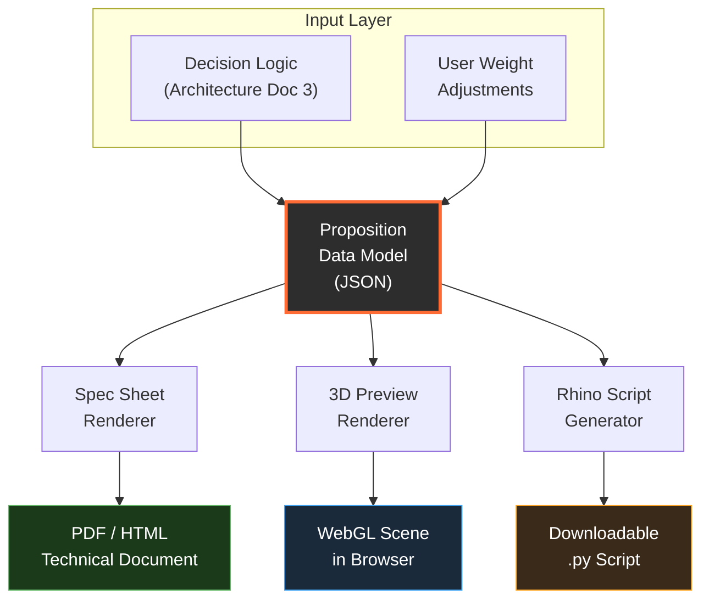

When the user adjusts a weight slider, the Proposition is recomputed by the Decision Logic module, and all three renderers consume the updated object. The renderers are stateless — they transform data into output, nothing more.

---

## 3. Output 1: Spec Sheet

### What it contains

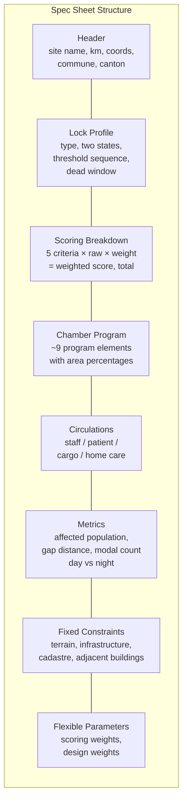

### Generation pipeline

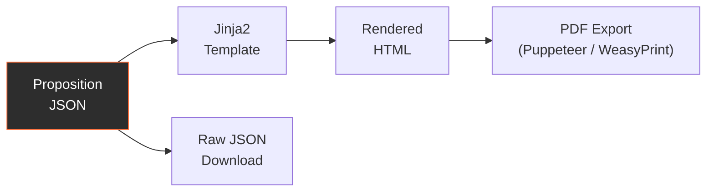

The spec sheet is the simplest renderer. It is a template that maps Proposition fields to labeled sections. Two output formats:

- **JSON** — machine-readable, used by the other two renderers and by any downstream tool. This is the canonical format.
- **HTML/PDF** — human-readable, styled with the project design system (see `design_system/SPEC.md`). Generated via Jinja2 template with CSS print styles. PDF conversion via headless Chromium (Puppeteer) or WeasyPrint.

The HTML version includes a radar chart of the 5 scoring criteria (using Chart.js or D3) and a stacked bar for program area distribution.

### Spec sheet data mapping

| Section | Proposition fields | Format |
|---------|-------------------|--------|
| Header | `site.*` | Name, km marker, dual coordinates |
| Lock Profile | `lock.*` | Lock type badge, state A/B labels, threshold diagram |
| Scoring | `scores.*` | Table: criterion, raw, weight, weighted. Radar chart. |
| Program | `chamber.program[]` | Stacked horizontal bar + table |
| Circulations | `chamber.circulations[]` | Diagram showing 4 paths through chamber plan |
| Metrics | `lock.dead_window`, `context.infrastructure.*`, `scores.night_worker_count.raw` | Key numbers in large type |
| Constraints | `context.terrain`, `context.cadastre`, `context.buildings` | Map thumbnail + constraint list |
| Parameters | `parameters.*` | Slider positions shown as values |

---

## 4. Output 2: 3D Preview

### Architecture

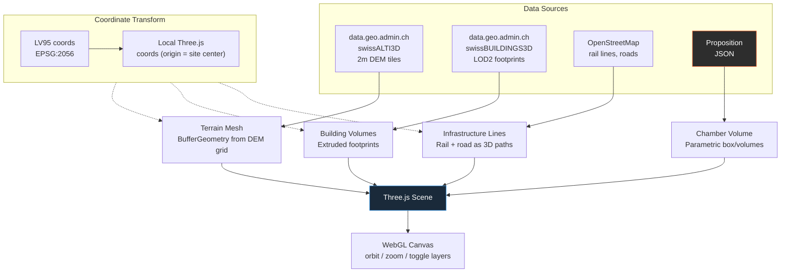

### Terrain pipeline

1. **Fetch**: Request DEM tiles from `api3.geo.admin.ch/rest/services/height` (swissALTI3D, 2m resolution). Bounding box = site center +/- 500m. Returns elevation grid.
2. **Parse**: Convert CSV/JSON elevation grid to a `Float32Array` of vertex positions.
3. **Mesh**: Create `THREE.PlaneBufferGeometry` with the correct vertex count, apply elevation values to Y coordinates.
4. **Material**: Hypsometric tinting (elevation-based color ramp) or neutral grey with contour-line texture.

### Building pipeline

1. **Fetch**: Query swissBUILDINGS3D via WFS from `api3.geo.admin.ch` — returns 2.5D footprints with roof heights.
2. **Filter**: Only buildings within 300m radius of site center.
3. **Extrude**: For each footprint polygon, create `THREE.ExtrudeGeometry` with height from the `DACH_MAX` (max roof height) attribute.
4. **Material**: Uniform light grey, semi-transparent. Adjacent buildings from `Proposition.context.buildings` get highlighted.

### Chamber generation (from Proposition)

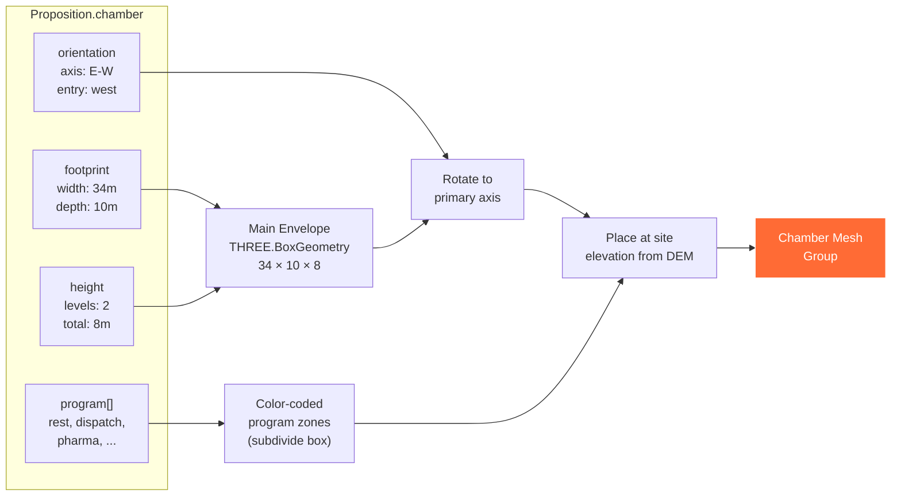

The chamber is NOT rendered as detailed architecture. It is a massing volume — a colored box subdivided into program zones. This matches the LOG 200-300 level of the existing Rhino scripts: defined volumes, not detailed construction.

### Lock state visualization

The 3D preview should communicate the lock's two states. Approach by lock type:

| Lock type | State A visualization | State B visualization |
|-----------|----------------------|----------------------|
| Temporal (Morges) | Dark scene, warm interior light, "night chamber" highlighted | Dawn light from east, "dawn chamber" highlighted |
| Gradient (CHUV) | Camera at bottom of slope, looking up | Camera at top, looking down — same volume, different perspective |
| Bridge (Rennaz) | Highlight station end, path fades toward hospital | Highlight hospital end, path fades toward station |
| Altitude | Valley-level camera with upward view | Hilltop camera with downward view |
| Border | Camera on border side | Camera on corridor side |

Implementation: toggle button switches scene lighting, camera position, and material emphasis. No geometry change — the same chamber is read differently.

### Interaction model

- **OrbitControls**: click-drag to rotate, scroll to zoom, right-drag to pan.
- **Layer toggles**: terrain on/off, buildings on/off, infrastructure on/off, chamber on/off.
- **State toggle**: switch between State A and State B visualization.
- **Info overlay**: hover on chamber zones to see program labels and areas from Proposition.

### Performance constraints

- Terrain tile radius: 500m from site center (1000m square). At 2m resolution = 250,000 vertices. Acceptable for modern GPUs but should use LOD decimation beyond 300m.
- Buildings: cap at 200 buildings within the 300m radius. LOD: beyond 200m, render as simple extruded rectangles ignoring roof detail.
- Target: 60fps on a 2020-era laptop with integrated graphics.

### Coordinate transform: LV95 to Three.js

```
three_x = (east_lv95 - site_center_east)
three_z = (north_lv95 - site_center_north) * -1   // Three.js Z is south
three_y = elevation - site_center_elevation         // Y is up in Three.js
```

All geometry is positioned relative to the site center (origin = `Proposition.site.coords_lv95`). This keeps coordinate values small and avoids floating-point precision issues.

### Alternative: MapLibre GL JS for context view

The prototypology explorer already uses Leaflet for 2D mapping. A dual-view approach may be more practical:

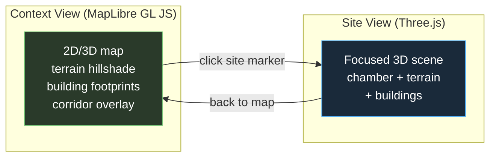

MapLibre GL JS handles the corridor-scale view with terrain hillshading and 3D building extrusion built in. Three.js handles the site-scale focused view with the parametric chamber. This avoids rebuilding map infrastructure in Three.js.

---

## 5. Output 3: Rhino Script

### What exists today

Three working scripts at LOG 200-300:

| Script | Lock type | File | Key geometry |
|--------|-----------|------|-------------|
| Lock 03 Morges | Temporal | `lock_03_morges_temporal.py` | Night chamber (15m) + Gate (4m) + Dawn chamber (15m). Two levels. Columns at 5m grid. Dawn window, west entrance, gate openings. |
| Lock 05 CHUV | Gradient | `lock_05_chuv_gradient_v2.py` | Four stepping levels following 15% grade. Central atrium void. Ramps along east edge. 20m wide x 34m deep. |
| Lock 07 Rennaz | Bridge | `lock_07_rennaz_bridge_v2.py` | 90m linear span. Station platform (south), elevated walkway (fast/slow lanes), hospital ramp (north). V-columns at 12m bays. |

All three scripts share the same structure:
1. Helper function (`box()` for creating boxes from min/max corners)
2. Layer setup (volumes, structure, openings, circulation, floor plates — each with a color)
3. Volume creation (main envelopes)
4. Structure (columns, slabs)
5. Openings (glazing, entrances, voids)
6. Circulation (paths, ramps, stairs)

All three use hardcoded dimensions. The parametric version must replace these with variables drawn from the Proposition.

### Parametric generation pipeline

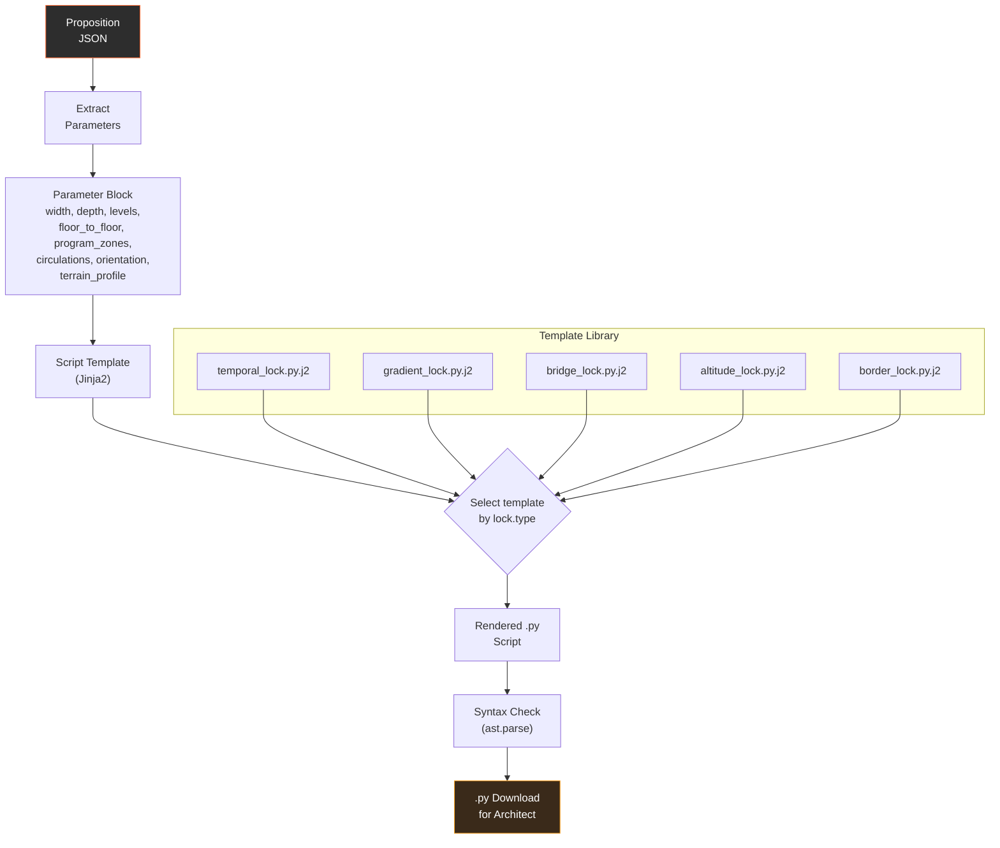

### Template approach

Each lock type has a Jinja2 template (`.py.j2`) that contains the full RhinoCommon script with parameter placeholders. Example structure for the temporal lock:

```python
# --- GENERATED SCRIPT — do not hand-edit ---
# Proposition: {{ proposition_id }}
# Site: {{ site.name }} (km {{ site.km }})
# Lock: {{ lock.type }} — {{ lock.name }}
# Generated: {{ timestamp }}

import rhinoscriptsyntax as rs

# -------------------------------------------------------
# PARAMETERS (from Proposition)
# -------------------------------------------------------
SITE_NAME = "{{ site.name }}"
LOCK_TYPE = "{{ lock.type }}"

# Chamber dimensions
WIDTH = {{ chamber.footprint.width_m }}      # total X extent
DEPTH = {{ chamber.footprint.depth_m }}      # total Y extent
LEVELS = {{ chamber.height.levels }}
FLOOR_TO_FLOOR = {{ chamber.height.floor_to_floor_m }}
TOTAL_HEIGHT = {{ chamber.height.total_m }}

# Program zones
PROGRAM = [

    {"type": "{{ p.type }}", "area_pct": {{ p.area_pct }}},

]

# Orientation
PRIMARY_AXIS = "{{ chamber.orientation.primary_axis }}"
ENTRY_DIR = "{{ chamber.orientation.entry_direction }}"

# Terrain
SITE_ELEVATION = {{ context.terrain.elevation_m }}
SLOPE_PCT = {{ context.terrain.slope_pct }}

# ... (geometry generation functions follow, using these variables)
```

### Parameter-to-geometry mapping

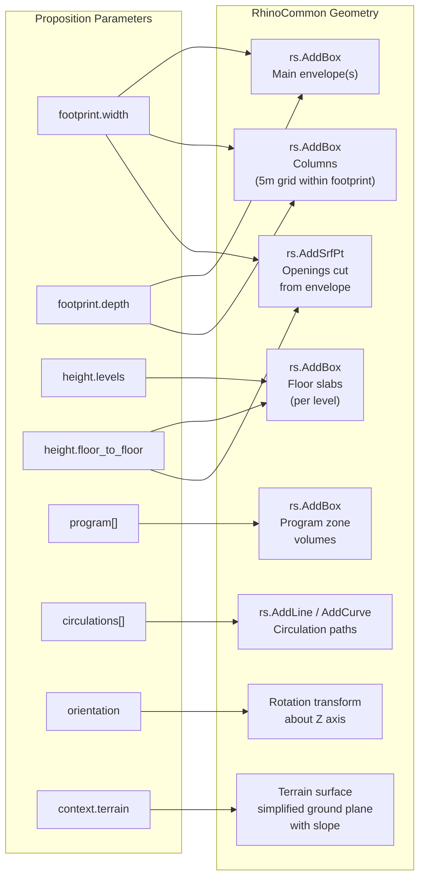

### What the generated script produces in Rhino

The script creates geometry on named layers, matching the existing convention:

| Layer | Content | Source parameters |
|-------|---------|-------------------|
| `Lock_XX::Volumes` | Main chamber envelope(s) | `footprint.*`, `height.*` |
| `Lock_XX::Structure` | Columns at 5m grid, floor slabs per level | `footprint.*`, `height.levels`, `height.floor_to_floor` |
| `Lock_XX::Openings` | Glazed faces, entrances, voids | `chamber.orientation`, `lock.type`-specific rules |
| `Lock_XX::Circulation` | Path lines for each circulation type | `chamber.circulations[]` |
| `Lock_XX::FloorPlates` | Horizontal slabs at each level | `height.levels`, `height.floor_to_floor` |
| `Lock_XX::Context` | Simplified terrain plane, adjacent building boxes, rail/road lines | `context.*` |

The `XX` in `Lock_XX` is the node ID from `Proposition.site.node_id`.

### From hardcoded to parametric: what changes

| Aspect | Current (3 scripts) | Parametric (template) |
|--------|---------------------|----------------------|
| Dimensions | Hardcoded numbers in `box()` calls | Variables from parameter block |
| Lock type | Implicit in script structure | Template selection by `lock.type` |
| Program zones | Not represented (only volumes) | Subdivided volumes colored by type |
| Circulations | Implicit in openings | Explicit path lines on circulation layer |
| Context | None | Terrain plane + adjacent building boxes from Proposition |
| Site coords | Origin = (0,0,0), architect places manually | Origin = (0,0,0) with metadata header showing real coords |
| Layers | Per-script naming | Consistent `Lock_{node_id}::` prefix |

### Stretch goal: Grasshopper definition

A `.gh` Grasshopper definition would allow architects to interactively adjust parameters post-generation. This requires serializing the Proposition parameters as Grasshopper number sliders and text panels, connected to geometry generation components. This is post-midterm scope.

---

## 6. Render Comparison

What each output shows and at what level of detail.

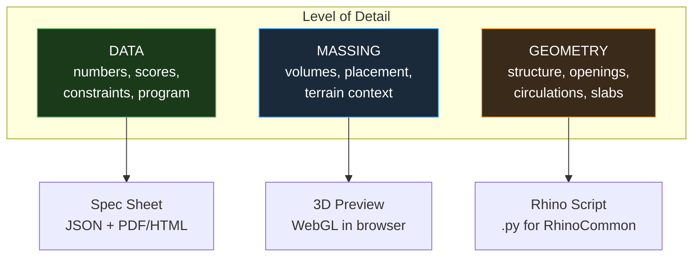

| Dimension | Spec Sheet | 3D Preview | Rhino Script |
|-----------|-----------|------------|-------------|
| **What you see** | Numbers, tables, charts | Colored volumes in terrain | Layered geometry with structure |
| **Level of detail** | Full data — every field in the Proposition | Massing volumes, approximate context | LOG 200-300: volumes, columns, slabs, openings |
| **Interaction** | Read, download | Orbit, zoom, toggle layers, switch states | Open in Rhino, modify, extend |
| **Technology** | Jinja2 + HTML/CSS + Chart.js | Three.js (site) + MapLibre GL (context) | Python + rhinoscriptsyntax + Rhino.Geometry |
| **Generation time** | < 1 second | 2-5 seconds (terrain fetch + render) | < 1 second (template render) |
| **File size** | ~50KB HTML, ~5KB JSON | N/A (rendered in browser) | ~15-30KB .py |
| **Audience** | Planner, reviewer, documentation | Client, public presentation, quick check | Architect doing design development |
| **Editability** | None (read-only output) | None (view-only) | Full — it is source code |

---

## 7. Pipeline Sequence Diagram

How the three outputs are generated in response to a user action.

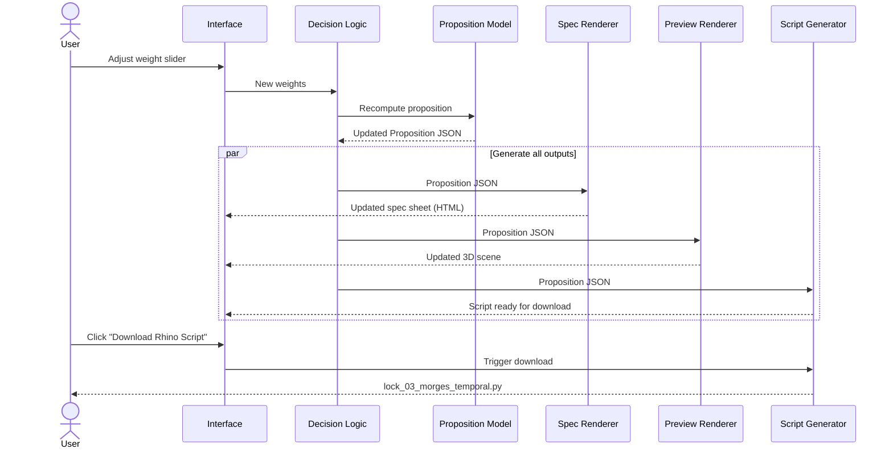

---

## 8. Data Format Boundaries

Where each format lives in the pipeline.

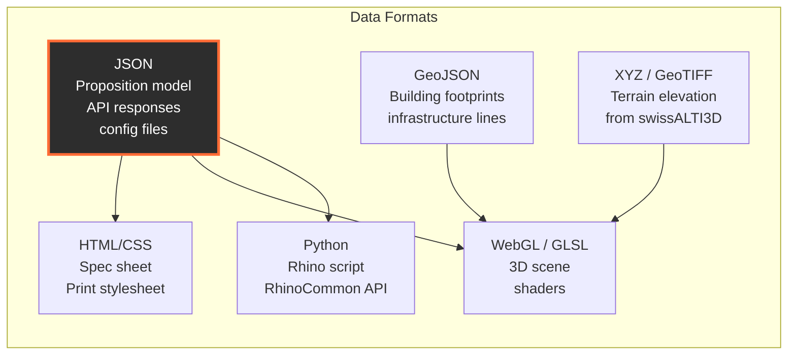

JSON is the lingua franca. Every renderer reads the Proposition as JSON. Terrain and building data arrive as GeoJSON or XYZ grids and are consumed only by the 3D preview renderer. The Rhino script is pure Python — no runtime data fetching, all parameters baked in at generation time.

---

## 9. Midterm vs Post-Midterm Scope

### Midterm (March 30)

| Output | Scope | Effort |
|--------|-------|--------|
| Spec sheet | Full — template + JSON + HTML rendering. All fields populated for healthcare community. | Low |
| 3D preview | Simplified — 2D MapLibre map with extruded chamber box overlay. No terrain mesh, no building volumes. Proof of concept only. | Medium |
| Rhino script | One parametric template (temporal lock). Demonstrate that changing Proposition parameters changes the generated script. Other lock types remain hardcoded. | Low |

### Post-Midterm

| Output | Scope | Effort |
|--------|-------|--------|
| Spec sheet | Add radar chart, print CSS, PDF export. | Low |
| 3D preview | Full Three.js site view with terrain mesh from DEM, building extrusions, lock state toggle. MapLibre for context. | High |
| Rhino script | Templates for all 5 lock types. Context layer (terrain, buildings). Grasshopper definition export (stretch). | Medium |

---

## 10. Open Technical Questions

These require decisions before implementation. Cross-reference with Architecture Doc 6 (Open Questions).

1. **3D preview vs prototypology explorer**: Should the 3D preview be embedded in the same page as the prototypology explorer map, or a separate full-screen view? Embedded keeps context; separate gives more screen space for the 3D scene.

2. **Terrain data caching**: DEM tiles are static. Should they be pre-fetched for all 9 nodes and bundled, or fetched on demand? Pre-fetching adds ~50MB to the deployment but eliminates API latency.

3. **Rhino script validation**: The generated `.py` passes `ast.parse()`, but does it run correctly in Rhino? Need a testing pipeline — either Rhino MCP automated execution or manual spot checks per template.

4. **Chamber subdivision logic**: How are program zones spatially arranged within the chamber footprint? The Proposition lists area percentages, but the spatial layout (which zone is where) needs rules per lock type. This is architectural design work, not engineering.

5. **24hr usage video**: Listed in the brain dump as an output type. This would require Blender rendering driven by a time-varying version of the Proposition (activity levels by hour). Classified as stretch goal — not part of the pipeline for now.
