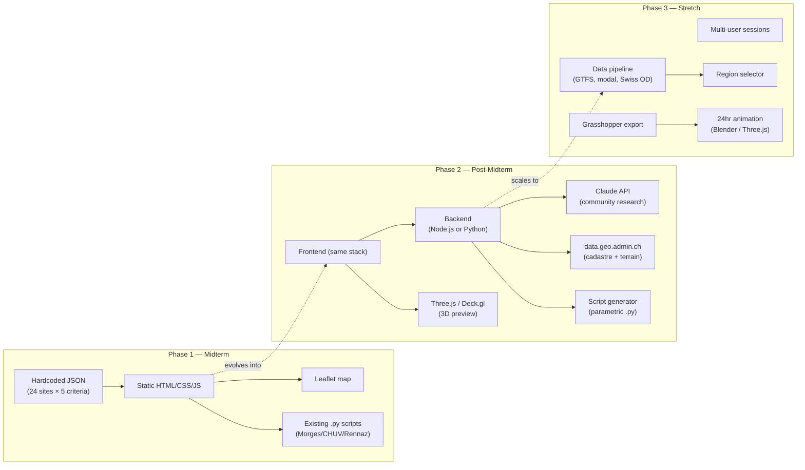
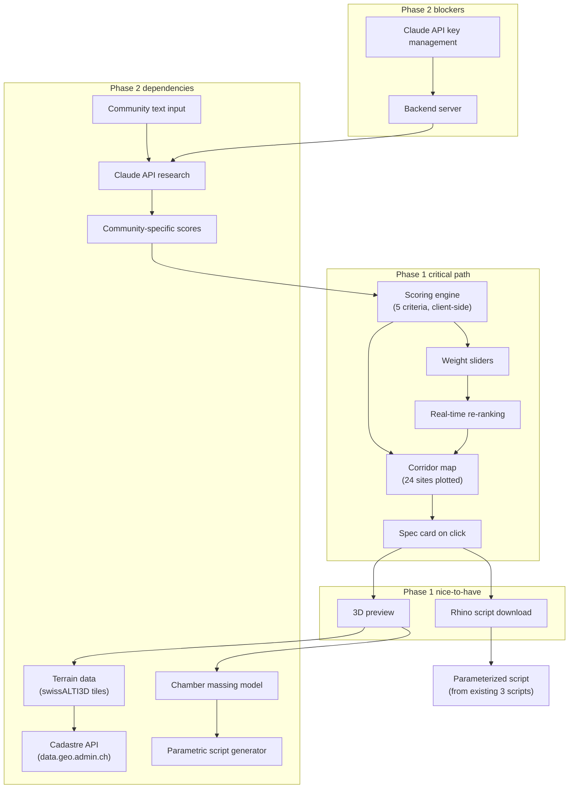
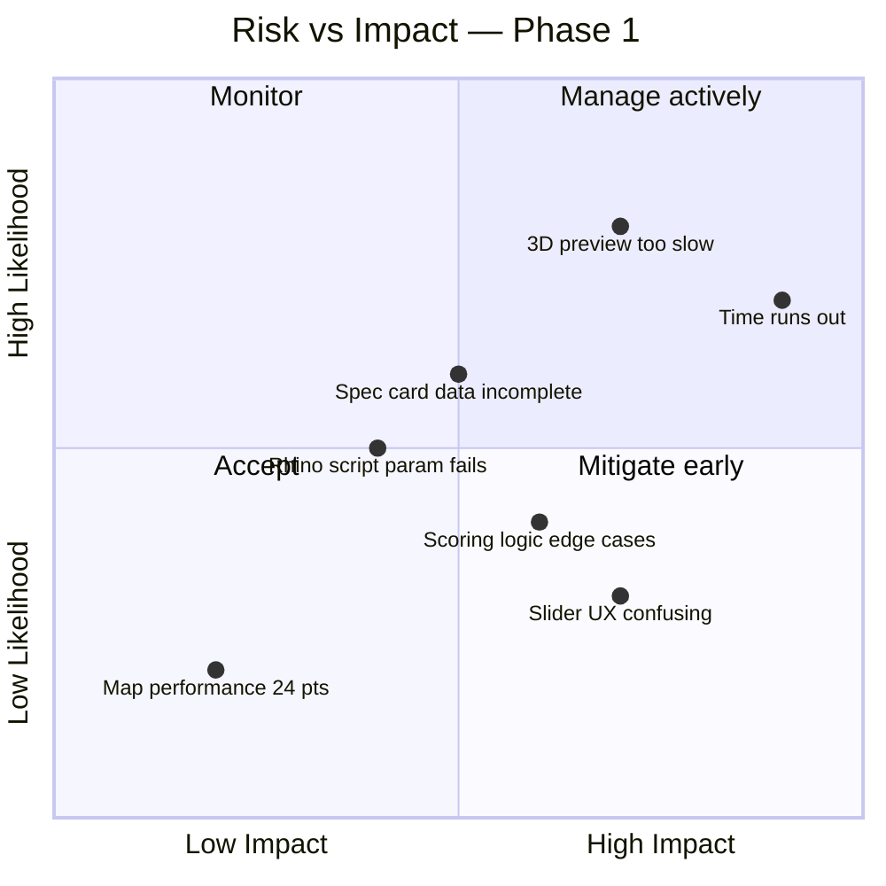
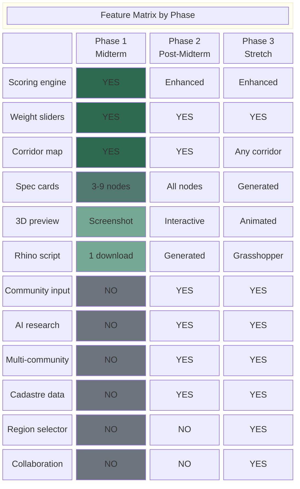

# Phasing — Still on the Line

**Document 5 of 6** | App Architecture Series
**Date:** 2026-03-18
**Authors:** Andrea Crespo + Claude Code (Cairn Code)

What to build when. Three phases, honest scope, fallback plans.

---

## Diagrams

### 1. Phase Timeline

```mermaid
gantt
    title Midterm Sprint — March 18 to March 30
    dateFormat YYYY-MM-DD
    axisFormat %b %d

    section Data
    Finalize 24-site scoring matrix        :d1, 2026-03-18, 2d
    Hardcode healthcare community JSON      :d2, after d1, 1d

    section Scoring Engine
    5-criteria scoring logic (JS)           :s1, 2026-03-19, 2d
    Weight sliders + real-time re-rank      :s2, after s1, 2d
    Threshold cutoff (top N selection)      :s3, after s2, 1d

    section Map
    Leaflet corridor base map               :m1, 2026-03-19, 1d
    Plot 24 sites (size/color by score)     :m2, after m1, 1d
    Click → spec card popup                 :m3, after m2, 2d
    Highlight top 9 vs rest                 :m4, after s3, 1d

    section Spec Cards
    Card template (lock type, scores, program) :c1, 2026-03-22, 2d
    Populate 3-5 nodes minimum              :c2, after c1, 2d
    All 9 nodes                             :c3, after c2, 2d

    section 3D Preview
    Static massing screenshot (1 node)      :3d1, 2026-03-25, 2d
    Terrain + massing on map (stretch)      :3d2, after 3d1, 2d

    section Rhino Output
    Parameterize existing script            :r1, 2026-03-24, 2d
    Download button on spec card            :r2, after r1, 1d

    section Polish
    Narrative intro panel                   :p1, 2026-03-28, 1d
    Demo walkthrough prep                   :p2, 2026-03-29, 1d

    section Milestones
    Internal test                           :milestone, 2026-03-27, 0d
    Midterm presentation                    :milestone, 2026-03-30, 0d
```

### 2. Technical Stack Evolution



### 3. Dependency Graph



### 4. Risk Assessment



### 5. Feature Matrix



---

## Phase 1: Midterm Demo

**March 18-30. 12 days. 1 architect + Claude Code.**

**Goal:** Prove the scoring logic works end-to-end for healthcare. The audience already understands the concept (Huang gave the green light March 16). This is not a product launch. It is a live demonstration that the relay-lock typology produces a verifiable, adjustable network of sites — not an arbitrary selection.

### Must deliver

| Component | What it does | Effort estimate |
|-----------|-------------|-----------------|
| **Scoring engine** | 24 candidate sites scored on 5 criteria (night workers, chain criticality, modal collapse, gap distance, infrastructure readiness). Pure client-side JS. Weighted sum, normalized 0-5. | 2 days |
| **Weight sliders** | 5 sliders, one per criterion. Move a slider, all 24 sites re-score and re-rank in real time. The top N (default: 9 above 3.0 threshold) are highlighted. | 1 day |
| **Corridor map** | Leaflet. Geneva to Villeneuve. All 24 candidate sites as circles. Radius and color encode total score. Top 9 visually distinct from the rest. | 1-2 days |
| **Spec cards** | Click any of the top 9 nodes. Panel shows: node name, km marker, lock type, threshold states (what enters vs what exits), chamber program, all 5 scores as a radar/bar chart. Minimum 3 cards fully populated, target all 9. | 3-4 days |
| **Rhino script download** | At least 1 node (Morges, CHUV, or Rennaz — scripts already exist) has a "Download .py" button on its spec card. Script is parameterized with site-specific values. | 1-2 days |

That totals roughly 8-11 working days, which is tight but achievable because the scoring data already exists (v2 paper) and the map is straightforward Leaflet work.

### Should deliver (if time allows)

- **All 9 spec cards populated** (vs minimum 3). This is data entry work, not engineering.
- **3D preview for 1 node**: a static screenshot of the Rhino model (terrain + chamber massing) embedded in the spec card. Not interactive Three.js — just an image with annotation. The existing Rhino scripts already produce this geometry.
- **Threshold slider**: adjust the 3.0 cutoff that separates "selected" from "candidate." Lets the audience see what happens when you're more or less selective.
- **Pushback demo**: select a region that scores poorly. The system highlights why and suggests where the typology fits better. This is the "AI is critical" principle from the braindump — but at midterm it can be hardcoded logic, not an AI call.

### Will not deliver

- Community selector (healthcare is hardcoded)
- Runtime AI research (no Claude API integration)
- Interactive 3D preview with terrain
- Multiple output formats
- Backend server
- User accounts or saved sessions

### What this proves

The scoring framework is systematic. Adjusting weights changes the network. The 9-node selection is not arbitrary — it emerges from measurable criteria. An architect can interrogate the logic, disagree with the weights, and see a different network form. That is the design argument.

---

## Phase 2: Post-Midterm (April-May)

**Goal:** Generalize from healthcare to any community. The tool starts to earn the word "tool."

### What changes

The hardcoded healthcare data becomes one instance of a general pattern. The architect types a community ("bakery industry," "night shift factory workers," "elderly care network") and the system researches it, scores sites against it, and proposes a network.

### New components

| Component | What it does | Dependencies |
|-----------|-------------|--------------|
| **Community text input** | Free-text field where architect describes a community and optionally a region of interest. | Frontend only |
| **AI research engine** | Claude API call that researches the described community's 24hr chain along the corridor. Returns structured data: enterprises, workers, shift patterns, transport needs, breaking points. | Backend (Node.js or Python), Claude API key |
| **Adapted scoring** | AI generates 2 community-specific criteria (replacing the healthcare-specific ones) plus scores for all 24 candidate sites. The 3 infrastructure criteria stay constant. | AI research output, scoring engine refactor |
| **Multi-community comparison** | Side-by-side view: how do healthcare, bakery, and factory communities produce different 9-node networks on the same corridor? Where do they overlap? | Multiple AI research results stored |
| **Full spec sheet** | JSON export of all parameters for a selected node. PDF generation for printing/sharing. | Spec card data model finalized |
| **3D preview (all nodes)** | Terrain (swissALTI3D) + chamber massing rendered in Three.js or Deck.gl. Interactive orbit, not just screenshots. | Terrain data pipeline, massing geometry |
| **Script generator** | Instead of downloading pre-existing scripts, generate a .py Rhino script from the node's parameters. Builds on the 3 existing scripts as templates. | Parameterized script template system |

### Technical decisions to make

**Backend architecture.** Two options:

1. **Minimal backend** (Node.js/Express or Python/FastAPI). Handles Claude API calls server-side. Keeps API keys secure. Adds ~1 day of setup. This is the responsible choice.
2. **Client-side Claude API** (browser calls Anthropic API directly). Simpler to build, but requires the user to enter their own API key or exposes ours. Acceptable for a studio tool, not for anything public.

Recommendation: option 1. A 50-line Express server is not overengineering.

**Terrain data.** swissALTI3D tiles from data.geo.admin.ch via WMS/WMTS. The existing Rhino pipeline already fetches XYZ grids (Wave 1 data committed). For web preview, we need to convert to a mesh format (GeoTIFF to Three.js terrain). This is a known pipeline — multiple open-source examples exist.

**Cadastre integration.** data.geo.admin.ch REST API for parcel boundaries. Needed to show buildable vs non-buildable land on the map. Straightforward API, well-documented.

### Biggest risk: AI research quality

The healthcare chain analysis took weeks of multi-session work across multiple Claude accounts. A single API call will not match that depth. Mitigations:

- Be transparent about confidence. Each AI-researched community gets a "research depth" indicator.
- Allow the architect to review and edit the AI's findings before scoring.
- Provide a "deep research" option that runs multiple sequential queries (slower, more expensive, better results).
- Accept that Phase 2 research will be shallower than the healthcare baseline. The point is demonstrating the pattern, not matching the quality of manual research.

---

## Phase 3: Stretch

**Goal:** The tool works beyond the Geneva-Villeneuve corridor.

This phase is genuinely ambitious. It probably requires a dedicated semester project or thesis. Including it here to show where the work leads, not to promise delivery.

### Features

| Feature | What it requires |
|---------|-----------------|
| **Region selector** | GTFS data pipeline for any Swiss rail corridor. Break point analysis from timetable data. Modal data (SharedMobility API, cantonal transport data). This is a significant data engineering effort. |
| **Data pipeline for new corridors** | Automated collection of the same data types we manually assembled for Geneva-Villeneuve: stations, ridership, diversity indices, night worker estimates, healthcare facilities, modal options. Swiss open data makes this possible but not easy. |
| **Grasshopper definition export** | Parametric definitions (.gh files) instead of scripted .py files. More flexible for architects. Requires building Grasshopper templates that accept JSON parameter input. |
| **24hr usage animation** | Visualize how a chamber is used across 24 hours. Blender render or Three.js animation. Shows the shift patterns, the dead window, the equalization sequence. Powerful for communication but heavy to produce. |
| **Collaborative mode** | Multiple architects adjusting weights simultaneously, seeing each other's proposed networks. WebSocket-based. Real collaboration feature, not just view-sharing. |
| **QGIS integration** | Export scoring data and site selections as GeoPackage/GeoJSON for spatial analysis in QGIS. Mostly a formatting concern — the data model already supports it. |

### What Huang's resources could enable

- **Compute credits**: Community research via Claude API is token-intensive. A full corridor scan for a new community might cost CHF 5-10 per run. At scale, this adds up.
- **Student testers**: Other studio students using the tool on their own sites/communities. Real feedback on whether the typology generalizes.
- **EPFL infrastructure**: Server hosting (vs. personal machine), GPU for 3D rendering if the preview becomes complex.
- **Cross-studio connections**: Other Sentient Cities projects working with similar corridor data. Shared data pipelines.

---

## Honest Assessment

### Phase 1 is achievable but has no slack

12 days, 1 person + Claude Code. The scoring engine and map are the core — probably 5-6 days of focused work. Spec cards are the most time-consuming part because they require writing content for each node (lock type descriptions, chamber programs, threshold state narratives). The v2 paper has this content but it needs to be structured as JSON.

**If time gets tight, cut in this order:**
1. Drop 3D preview entirely (show Rhino screenshots in the presentation slides instead)
2. Reduce spec cards from 9 to 3 (Morges, CHUV, Rennaz — the 3 with existing scripts)
3. Drop Rhino script download (show the script in the presentation, don't wire up the download)
4. Never cut the scoring engine + sliders + map. That IS the demo.

### Phase 2 is 2-3 months of work

April and May give roughly 8-10 weeks. The backend, AI research engine, and multi-community comparison are each multi-day efforts. The 3D preview requires a terrain data pipeline that does not yet exist for web. Realistic target: have the community input and AI research working by end of April, 3D preview by end of May.

### Phase 3 is a thesis

Listing it is useful for Huang (shows where funding and resources would go) and for Andrea (maps the full vision). But building it requires either a dedicated summer project or handing off parts to other students. The data pipeline alone — generalizing from one corridor to any Swiss corridor — is a substantial engineering project.

### The scoring IS the argument

For midterm, the most important thing is not the interface polish or the 3D preview. It is the moment when Huang moves a weight slider and watches the network reorganize. That interaction proves the typology is systematic. Everything else (spec cards, 3D, downloads) supports that moment but does not replace it.

If on March 28 the scoring engine works perfectly and the spec cards are half-done, that is a successful midterm. If the spec cards are beautiful but the sliders are broken, that is a failed midterm.

### What could go wrong

| Risk | Likelihood | Impact | Fallback |
|------|-----------|--------|----------|
| Time runs out before spec cards are done | High | Medium | Show 3 cards, narrate the rest |
| 3D preview is too complex for 12 days | High | Low | Static screenshots in slides |
| Scoring edge cases (ties, all scores similar) | Medium | Medium | Manual tiebreaking rules, tested before demo |
| Leaflet map performance | Low | Low | 24 points is nothing for Leaflet |
| Rhino script parameterization breaks | Medium | Low | Download the unparameterized script, explain in presentation |
| Slider UX is confusing to audience | Medium | High | Pre-set "scenarios" (equal weights, healthcare-biased, infrastructure-biased) as presets alongside free sliders |
| Claude API quality for Phase 2 research | High | High | Longer-term: multi-query pipeline. Short-term: human-in-the-loop review of AI output |

---

## Decision Log

Decisions to make before or during Phase 1, recorded here as they're resolved.

| Decision | Options | Status |
|----------|---------|--------|
| Frontend framework | Vanilla JS / Svelte / React | Open — vanilla JS is fastest for Phase 1 |
| Map library | Leaflet / Mapbox GL / Deck.gl | Leaning Leaflet (known, free, sufficient for 2D) |
| Spec card format | Modal popup / side panel / separate page | Open |
| Score normalization | Min-max per criterion / z-score / fixed 0-5 scale | Open — depends on data distribution |
| Hosting for demo | Local / GitHub Pages / EPFL server | Local is fine for midterm |
| 3D preview approach | Three.js in-browser / static screenshot / Rhino viewport embed | Likely static screenshot for Phase 1 |
