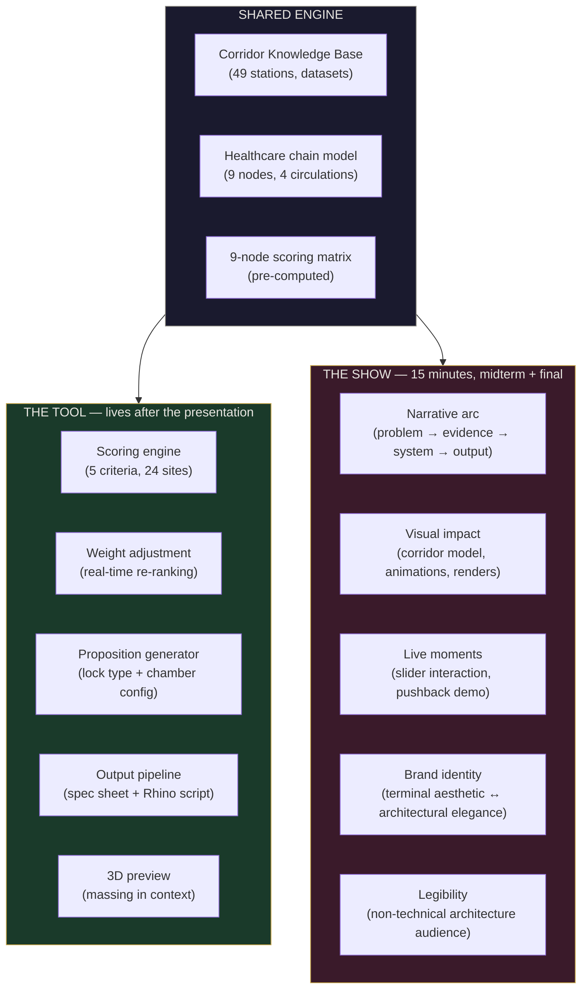
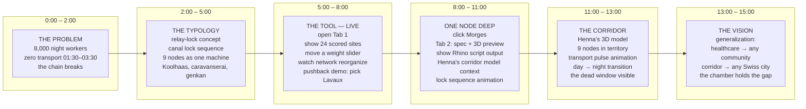
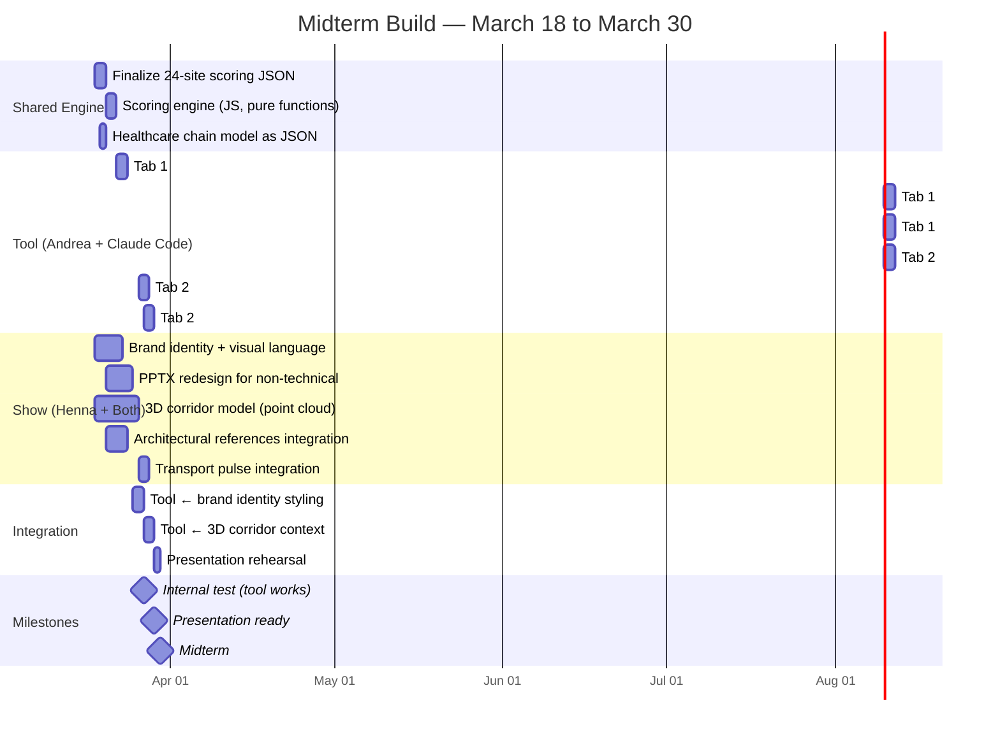

# v2 — Tool vs Presentation Strategy

**Architecture Document v2** — Still on the Line
Builds on v1 docs (architecture_overview through open_questions). Does not replace them — v1 defines the engine, v2 defines how it's experienced.

Written after reviewing DIDI's brainstorm, LOCKBOARD task split, and the actual context of both team members' work.

---

## The distinction

Two things are being built simultaneously. They share an engine but serve different purposes.



**The tool** is what an architect opens after the presentation. Direct access, no narrative frame, two tabs, get to work.

**The show** is what the jury experiences for 15 minutes. Curated path, visual impact, controlled moments of interactivity, legible to people who don't know what a repo or a backend is.

They share the same data and the same scoring engine. But they are designed for different people at different moments.

---

## The tool: two tabs

Andrea and Henna's discussion: two tabs. Simple. The architect's workflow is: analyze → choose → export.

### Tab 1: Analysis

```
+------------------------------------------------------------------+
|  COMMUNITY  [ healthcare ▾ ]        CORRIDOR MAP (Leaflet/WGS84) |
|                                     [ 101km, 49 stations ]       |
|  REGION     [ full corridor ▾ ]     [ 24 candidates as circles ] |
|             or click map            [ size = score, color = tier ]|
|                                     [ top 9 highlighted gold ]   |
|  SCORING WEIGHTS                    [ click → node detail panel ]|
|  Affected pop.   [====|=] 25%      |                            |
|  Chain critical.  [====|=] 25%      |                            |
|  Modal collapse   [===|==] 20%      +------- NODE DETAIL -------+|
|  Gap distance     [==|===] 15%      | Morges — Temporal Lock     ||
|  Infra readiness  [==|===] 15%      | Score: 4.30 / 5.0         ||
|                                     | Dead window: 01:07–04:01   ||
|  THRESHOLD  [=======|=] 3.0        | Circulations: staff,       ||
|                                     |   patient, cargo, pharma   ||
|  [ VIEW NETWORK ]  [ COMPARE ]     | [ → GO TO OUTPUTS ]        ||
+------------------------------------------------------------------+
```

This is the v1 architecture's interface, simplified. The map IS the interface. Everything else is panels.

**What happens here:**
- Architect sees all 24 candidates scored
- Adjusts weights → sites re-rank in real time
- Clicks a node → detail panel with lock type, scores, chamber program
- "View Network" shows all qualifying nodes as one relay chain
- "Compare" (post-midterm) overlays two communities' networks

### Tab 2: Outputs

Only accessible after selecting a node from Tab 1. This is the architect's workbench.

```
+------------------------------------------------------------------+
|  NODE: Morges — Temporal Lock (km 48)              [ ← BACK ]    |
|                                                                   |
|  +------------------+  +--------------------------------------+  |
|  | SPEC SHEET       |  | 3D PREVIEW                           |  |
|  |                  |  |                                       |  |
|  | Lock: Temporal   |  | [Three.js / MapLibre scene]          |  |
|  | Score: 4.30      |  | [terrain + chamber massing]          |  |
|  | Dead window:     |  | [orbit, zoom, toggle layers]         |  |
|  |  01:07 – 04:01   |  |                                       |  |
|  | Night workers:   |  | [ State A ◉ ]  [ State B ○ ]         |  |
|  |  550 stranded    |  | (last train)    (first train)         |  |
|  |                  |  |                                       |  |
|  | Program:         |  +--------------------------------------+  |
|  |  rest 25%        |                                            |
|  |  dispatch 15%    |  CHAMBER PARAMETERS                        |
|  |  pharma 10%      |  Visibility    [====|=====] Discretion     |
|  |  info 10%        |  Low carbon    [=====|====] Max comfort    |
|  |  kitchen 10%     |  Permanent     [===|======] Lightweight    |
|  |  viewing 10%     |  Enclosed      [======|===] Open           |
|  |  cargo 10%       |                                            |
|  |  sanitary 5%     |  +--------------------------------------+  |
|  |  circulation 5%  |  | EXPORTS                               |  |
|  |                  |  | [ ↓ Spec Sheet (PDF) ]                |  |
|  | Circulations:    |  | [ ↓ Spec Sheet (JSON) ]               |  |
|  |  ① Staff         |  | [ ↓ Rhino Script (.py) ]              |  |
|  |  ② Patient       |  | [ ↓ Proposition (JSON) ]              |  |
|  |  ③ Cargo         |  +--------------------------------------+  |
|  |  ④ Home care     |                                            |
|  +------------------+                                            |
+------------------------------------------------------------------+
```

**What happens here:**
- Spec sheet: all data for this node, printable
- 3D preview: chamber massing in terrain context (MapLibre for midterm, Three.js for final)
- Chamber parameters: design sliders that affect form, not site selection (separate from Tab 1 weights)
- Exports: downloadable files — the actual deliverables an architect walks away with

### Why two tabs, not five views

DIDI's five views (Landing → Chain Explorer → Node Map → Chamber Designer → System View) are a story. They guide someone who has never seen the project. An architect returning to the tool for the fifth time doesn't want to click through a landing page.

Two tabs = two actions. Tab 1: decide where. Tab 2: decide what.

The Chain Explorer and System View from DIDI's plan are presentation features, not tool features. They belong in the show.

---

## The show: 15-minute midterm

The audience: Huang, assistants, architecture students. They know the corridor, they know the concept (green light from March 16 crit). They don't know how the tool works. They don't know what a scoring engine is. They don't know what a Rhino MCP is.

### What they need to walk away with

1. **The typology is real** — it's not 9 arbitrary points, it's a scored system that responds to data
2. **The tool is real** — it works, you can interact with it, it produces outputs
3. **It generalizes** — healthcare is the proof, but the framework applies to other communities
4. **The team built it with AI** — not as a gimmick, but as a skill environment where human judgment drives AI capability
5. **The corridor model grounds it** — Henna's 3D work shows these aren't abstract nodes, they're real places with terrain, buildings, infrastructure

### Presentation structure

The PPTX template has 6 screens. Here's how the 15 minutes could map:



### What's tool, what's presentation asset

| Element | Tool feature? | Presentation asset? | Who builds it |
|---------|:---:|:---:|---|
| Scoring engine + weight sliders | Yes | Yes (live demo) | Andrea + Claude Code |
| Corridor map with 24 scored sites | Yes | Yes (live demo) | Andrea + Claude Code |
| Node detail panel / spec card | Yes | Yes (live demo) | Andrea + Claude Code |
| 3D preview (massing in context) | Yes | Yes (if ready) | Andrea + Claude Code |
| Rhino script export | Yes | Yes (show output) | Andrea + Claude Code |
| Chamber parameter sliders | Yes (Tab 2) | No (post-midterm) | Andrea + Claude Code |
| Transport pulse 24h animation | No | Yes | Already built (v2/v3) |
| 3D corridor model (point cloud) | No | Yes | Henna + Rhino/Blender |
| Lock sequence animation | No | Yes (would be powerful) | Could be HTML or Blender |
| Healthcare chain diagram | No | Yes | Already built (v3) |
| AI workflow explanation | No | Yes | Henna (PPTX redesign) |
| Brand identity / visual design | Both | Yes | Henna |
| Karim's diary / narrative device | No | Maybe (closing?) | Henna/Cadence (already exists) |
| Architectural references panel | No | Yes (slides) | Henna |
| Pushback demo ("Lavaux → no") | Yes (logic) | Yes (live moment) | Andrea + Claude Code |
| Generalization demo (2nd community) | Yes (post-midterm) | Yes (even as mockup) | Could be pre-rendered |

### The live moments

In 15 minutes, you get maybe 2-3 live interactions with the tool. Choose them carefully:

**Live moment 1: Weight slider** (the proof)
Move "modal collapse severity" from 20% to 40%. Watch 2-3 sites drop out of the network, 1-2 new ones appear. The audience sees: this isn't arbitrary. The system responds to what you value.

**Live moment 2: Pushback** (the character)
Click on Lavaux (the UNESCO fracture zone). The system says: "This region scores 1.8. The Lavaux Fracture is a permanent structural void. Nearest viable nodes: Lausanne CHUV (4.55, 15km west) and Vevey (3.25, 8km east)." A tool that says no is memorable.

**Live moment 3: Node deep-dive** (the output)
Click Morges. Tab 2 opens. Show the spec sheet, the 3D preview (even if simplified), the Rhino script download. "This is what an architect walks away with."

Everything else is slides, animations, and Henna's visuals. Pre-rendered, controlled, no risk of failure.

---

## Henna's work in the tool and show

Based on LOCKBOARD and CONTEXT_HENNA — Henna's contributions are structural, not decorative:

### In the tool

| Henna's work | Where it appears | How |
|---|---|---|
| 3D corridor model | Tab 2: 3D preview context | The terrain and building geometry that chambers sit in |
| Blender/Rhino MCP | Tab 2: live Rhino viewport (stretch) | If MCP bridge works, show chamber generation live |
| Brand identity | Both tabs | The visual language that makes the tool feel like architecture, not software |
| Thermal comfort data (33 sites) | Tab 2: chamber parameters (post-midterm) | UHI data at a site → affects transparency/ventilation defaults |
| Night workers data (51 records) | Tab 1: scoring input | Feeds the "affected population" criterion |
| Late-night venues (133) | Tab 1: context layer on map | Shows what exists during dead window |
| Buildings classified (218,437) | Tab 2: 3D context | Building footprints around chamber sites |
| Psycho-comfort surveys | Tab 2: program selection (post-midterm) | Comfort data → which program elements the chamber includes |

### In the show

| Henna's work | Presentation moment | Impact |
|---|---|---|
| 3D corridor model | Minutes 8-11 — "The Corridor" | Grounds the abstract 9-node network in real geography |
| PPTX redesign | Entire presentation | Makes AI workflow legible to architecture students |
| Brand identity | Entire presentation | Terminal aesthetic ↔ architectural elegance balance |
| Architectural references | Minutes 2-5 — "The Typology" | Koolhaas, Jacobs, canal locks — intellectual grounding |
| Healthcare chain diagram (v3) | Minutes 0-2 — "The Problem" | 4-layer gap analysis — what breaks at 2am |
| Transport pulse animation | Minutes 11-13 | 29,135 trips → zero. The dead window made visceral |
| Karim's diary | Possible bookend | Human voice in a data-driven presentation |

### The brand identity question

From LOCKBOARD: "find the balance between tmux terminal aesthetic and elegant architecture presentation. The aesthetic shifts per slide depending on the nature of the concept."

This applies to the tool too. The tool should not look like a developer dashboard. It should not look like Figma. It should look like something an architecture studio would recognize as their own.

The design system exists (SPEC.md): Instrument Serif for headings, DM Mono for data, DM Sans for body, gold #c9a84c on dark #0a0a0f. But the tool needs to feel like the corridor — long, horizontal, the darkness of the dead window, the gold of the accent lights.

The PPTX is where Henna's brand work lands first. The tool inherits from it, not the other way around. Whatever visual language Henna establishes for explaining the AI workflow to non-technical students — that language should carry into the tool's interface.

---

## Build sequence: what's shared, what's separate



### Critical path

The tool's critical path: scoring engine → map → sliders → node detail → spec sheet. That's Tab 1 + the beginning of Tab 2. If this works, the midterm demo works.

Henna's critical path: brand identity → PPTX → corridor model. If these land, the presentation has impact.

The integration points are late (March 25-27): styling the tool with Henna's visual language, and embedding corridor context in the 3D preview. If these slip, the tool looks functional but rough, and the corridor model is shown in Rhino separately. Acceptable fallback.

### What the tool looks like at midterm vs final

| Feature | Midterm | Final review |
|---------|---------|-------------|
| Tab 1: Map + scoring | Working, live | Working, polished |
| Tab 1: Weight sliders | Working, live | Working + presets ("healthcare-biased", "infrastructure-biased") |
| Tab 1: Node detail | 3-9 cards populated | All 9, with expanded data |
| Tab 1: Pushback | Hardcoded for Lavaux | Logic-driven for any region |
| Tab 2: Spec sheet | HTML, basic styling | PDF export, radar chart, print CSS |
| Tab 2: 3D preview | MapLibre with chamber box (maybe) | Three.js with terrain + buildings + lock state toggle |
| Tab 2: Chamber params | Not present | Sliders for visibility, carbon, comfort, materiality |
| Tab 2: Rhino export | 1 script (Morges or CHUV) | Parametric template for any lock type |
| Community selection | Healthcare only (hardcoded) | Text input → Claude API research |
| Corridor model | Shown separately (Henna's Rhino) | Integrated in Tab 2 context |
| Brand identity | Applied to tool styling | Mature, consistent with PPTX |

---

## On framing: skill environment, not agentic workflow

From the March 17 strategic session and CLAUDE.md: frame as human-AI collaboration / skill environment, NOT "agentic workflow."

This matters for both the tool and the show:

**In the tool**: The AI doesn't decide. It researches, scores, and proposes. The architect decides — by choosing weights, accepting or rejecting regions, adjusting chamber parameters. The tool makes the architect's judgment more informed, not less necessary. The pushback feature is the clearest expression: the tool has an opinion, but the architect has the final say.

**In the show**: Don't present Claude as "the agent that built this." Present the team as three collaborators — Andrea (concept, data, app logic), Henna (corridor model, references, visual identity), Claude (research engine, code generation, data processing). The AI workflow diagram that Henna is redesigning should show this as a skill environment where each team member brings different capabilities, not a pipeline where AI replaces human work.

The PPTX challenge (from LOCKBOARD): "explain the AI workflow to architecture students who don't know what repos, git, .claude, CLAUDE.md, backend/frontend are." The answer is not to explain these things. It's to show the RESULT — the tool working, the outputs generated, the corridor modeled — and say "we built this with AI as a team member." The technical infrastructure is invisible in the presentation. It's visible in the repo for anyone who wants to look.

---

## Relationship to v1 docs

v1 docs (architecture_overview through open_questions) define the engine. They are implementation docs for Andrea + Claude Code. They stand as-is.

This v2 doc adds:
- **The two-tab structure** (replacing v1's monolithic interface wireframe)
- **The tool/show separation** (not in v1)
- **Henna's integration points** (underrepresented in v1)
- **The 15-minute presentation arc** (not in v1)
- **The brand identity dependency** (not in v1)
- **The framing guidance** (skill environment, not agentic)

v1's scoring engine, data flow, decision logic, output pipeline, and phasing remain the technical backbone. v2 wraps them in the experience layer — how the engine becomes a tool someone uses, and a story someone watches.

---

## Open decisions (v2-specific)

| Decision | Options | Proposed default | Deadline |
|----------|---------|-----------------|----------|
| Two-tab navigation | Tabs / URL routing / single page with scroll | Tabs (simple, no routing needed) | March 22 |
| When does Henna's brand enter the tool? | From start / late integration | Late integration (March 25) — tool works first, looks good second | March 25 |
| Presentation tool vs slides | Live tool demo / pre-recorded / hybrid | Hybrid — live for 3 moments, slides for everything else | March 28 |
| Where does corridor model appear? | In tool Tab 2 / separate Rhino window / video | Separate Rhino window for midterm, integrated for final | March 27 |
| Transport pulse in presentation | Embedded / separate window / video loop | Separate window, switched to during "The Corridor" segment | March 28 |
| Generalization demo | Live (2nd community) / pre-rendered / verbal | Verbal + 1 mockup slide showing bakery network | March 29 |
